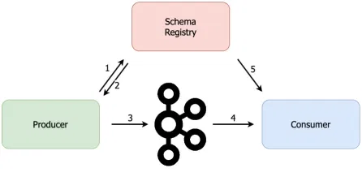

git clone https://github.com/confluentinc/cp-helm-charts.git

helm install schema-registry --set kafka.bootstrapServers="PLAINTEXT://worker1.bigdata.com:9092,PLAINTEXT://worker2.bigdata.com:9092,PLAINTEXT://worker3.bigdata.com:9092" cp-helm-charts/cp-schema-registry

jmxUrl: service:jmx:rmi:///jndi/rmi://localhost:5555/jmxrmi
lowercaseOutputName: true
lowercaseOutputLabelNames: true
ssl: false
whitelistObjectNames:
- kafka.schema.registry:type=jetty-metrics
- kafka.schema.registry:type=master-slave-role
- kafka.schema.registry:type=jersey-metrics
rules:
- pattern : 'kafka.schema.registry<type=jetty-metrics>([^:]+):'
  name: "cp_kafka_schema_registry_jetty_metrics_$1"
- pattern : 'kafka.schema.registry<type=master-slave-role>([^:]+):'
  name: "cp_kafka_schema_registry_master_slave_role"
- pattern : 'kafka.schema.registry<type=jersey-metrics>([^:]+):'
  name: "cp_kafka_schema_registry_jersey_metrics_$1"

# Confluent Schema Registry & REST Proxy

### Architecture diagram : Schema Registry



### Architecture diagram : REST Proxy


# AVRO

## Introduction

Apache Avro™ is a data serialization system.

Avro provides:

- Rich data structures.
- A compact, fast, binary data format.
- A container file, to store persistent data.
- Remote procedure call (RPC).
- Simple integration with dynamic languages. Code generation is not required to read or write data files nor to use or implement RPC protocols. Code generation as an optional optimization, only worth implementing for statically typed languages.

## Schemas

Avro relies on schemas. When Avro data is read, the schema used when writing it is always present. This permits each datum to be written with no per-value overheads, making serialization both fast and small. This also facilitates use with dynamic, scripting languages, since data, together with its schema, is fully self-describing.

When Avro data is stored in a file, its schema is stored with it, so that files may be processed later by any program. If the program reading the data expects a different schema this can be easily resolved, since both schemas are present.

When Avro is used in RPC, the client and server exchange schemas in the connection handshake. (This can be optimized so that, for most calls, no schemas are actually transmitted.) Since both client and server both have the other's full schema, correspondence between same named fields, missing fields, extra fields, etc. can all be easily resolved.

Avro schemas are defined with JSON . This facilitates implementation in languages that already have JSON libraries.

## Comparison with other systems

Avro provides functionality similar to systems such as Thrift, Protocol Buffers, etc. Avro differs from these systems in the following fundamental aspects.

- Dynamic typing: Avro does not require that code be generated. Data is always accompanied by a schema that permits full processing of that data without code generation, static datatypes, etc. This facilitates construction of generic data-processing systems and languages.
- Untagged data: Since the schema is present when data is read, considerably less type information need be encoded with data, resulting in smaller serialization size.
- No manually-assigned field IDs: When a schema changes, both the old and new schema are always present when processing data, so differences may be resolved symbolically, using field names.

### Defining a schema

Avro schemas are defined using JSON. Schemas are composed of primitive types (null, boolean, int, long, float, double, bytes, and string) and complex types (record, enum, array, map, union, and fixed). You can learn more about Avro schemas and types from the specification, but for now let's start with a simple schema example, user.avsc:

```
{
    "namespace": "example.avro",
    "type": "record",
    "name": "User",
    "fields": [
        {"name": "name", "type": "string"},
        {"name": "favorite_number",  "type": ["int", "null"]},
        {"name": "favorite_color", "type": ["string", "null"]}
    ]
}
```

## Advantages

- Data is fully typed.
- Data is compressed automatically (less CPU usage).
- Schema (degined using JSON) comes along with the data.
- Documentation is embedded in the Schema
- Data can be read across any language.
- Schema can evolve over the time, in a safe manner (Schema Evolution)

## Disadvantages

- Avro support for some languages may be lacking.
- Can't print the data without using the avro-tools.

```
NOTE:

Avro has been chosen as the only supported data format from Confluent Schema Registry.
```

## Avro Primitive Types:

Primitive Types

- null
- boolean
- int
- long
- float
- double
- bytes
- string

## AVRO Record Schemas

Avro Record Schemas are defined using JSON. It has some common fields:

- Name: Name of the Schema
- Namespace: Same as package in Java
- Doc: Documentation to explain the Schema
- Aliases: Optional other names of the schema
- Fields:
    - Name: Name of the field
    - Doc: Documentation of the field
    - Type: Data type for the field
    - Default: Default value of the field

Example:

```
{
    "type": "record",
    "namespace: "com.bigdata.avro.example",
    "name": "Customer",
    "doc": "Avro Schema for Customer",
    "fields": [
        { "name": "first_name", "type": "string", "doc": "First Name of the Customer" },
        { "name": "last_name", "type": "string", "doc": "Last Name of the Customer" },
        { "name": "age", "type": "int", "doc": "Age of the Customer" },
        { "name": "height", "type": "float", "doc": "Height of the Customer in cms" },
        { "name": "weight", "type": "float", "doc": "Weight of the Customer in kgs" },
        { "name": "automated_email", "type": "boolean", "default": true, "doc": "true if user wants an automated email" }

    ]
}
```

## Complex Types

Complext types:

- Enums
- Arrays
- Maps
- Unions
- Calling other schemas as types

### Enums

These are for the fields the values are known for sure.

Example: Customer Status

- Bronze
- Silver
- Gold

```
{
    "type": "enum",
    "name": "customer_status",
    "symbols" [
        "BRONZE",
        "SILVER",
        "GOLD"
    ]
}
```

NOTE:

Once an ENUM is set, changing enum values is forbidden, if we wanted to maintain Compatibility

### ARRAYS

Arrays are used to represent a list of undefined size of items that share the same schema.

Example: Customer Emails (multiple emails)

["user1@gmail.com", "user1@outlook.com", "user1@yahoo.com"]

```
{
    "type": "array",
    "items": "string"
}
```

### MAPS

Maps are used to define a list of keys and values, where keys are string.

Example : Secret Questions

- "What is your favourite colour ?" : "Green"
- "Where were you born ?" : "India"

```
{
    "type": "map",
    "values": "string"
}
```

### Unions

Union can allow a field value to take different types.

Example : ["string", "int", "boolean"]

If defaults are defined, the default must be of the type of the first item in the Union (In the above case it is "string")

The most common use case of Unions is to define an Optional Value

```
{
    "name": "middle_name",
    "type": ["null", "string"],
    "default": null
}
```

NOTE: For default value write null not "null" (This is a string null)

### Defining a Complex Schema

```
[
    {
        "type": "record",
        "namespace": "com.bigdata.avro.example",
        "name": "CustomerAddress",
        "doc": "Customer Address Details"
        "fields": [
            {"name": "Address", "type": "string", "doc": "Address of the Customer"},
            {"name": "City", "type": "string", "doc": "City of the Customer"},
            {"name": "PostalCode", "type": [ "int", "string" ], "default": -1, "doc": "Postal Code of the Customer"},
            {"name": "Type", "type": "enum", "symbols": [ "PO BOX", "RESIDENTIAL", "ENTERPRISE" ], "doc": "Type of the Customer"}
        ]
    }, {
        "type": "record",
        "namespace": "com.bigdata.avro.example2",
        "name": "Customer",
        "doc": "Customer Details",
        "fields": [
            {"name": "first_name", "type": "string", "doc": "First Name of the Customer"},
            {"name": "middle_name", "type": [ "null", "string" ], "default": null, "doc": "Middle Name of the Customer"},
            {"name": "last_name", "type": "string", "doc": "Last Name of the Customer"},
            {"name": "age", "type": "int", "doc": "Age of the Customer"},
            { "name": "height", "type": "float", "doc": "Height of the Customer in cms" },
            { "name": "weight", "type": "float", "doc": "Weight of the Customer in kgs" },
            {"name": "automated_email", "type": "boolean", "default" : true, "doc": "True if user wants automated emails"},
            {"name": "emails", "type": "array", "items": "string", "default": [],  "doc": "Customer Emails"},
            {"name": "customer_address", "type": "CustomerAddress", "doc": "Customer Address"}
        ]
    }
]
```

## Logical Types

- Avro has a concept of logical types used to give more meaning to already existing primitive types.
- The most commonly used are:
    - decimals (bytes)
    - date (int) - number of days since unix epoch (Jan 1st 1970)
    - time-millis (long) - number of milliseconds after midnight, 00:00:00.000
    - timestamp-millis (long) - number of milliseconds from unix epoch, 1st Jan 1970 UTC
- To use a logical type, "logicalType" should be added to the field name and it will help avro schema processors to interpret a specific type.

### timestamp-millis

Example:

```
{
    "name": "signup_ts",
    "type": "long",
    "logicalType": "timestamp-millis",
    "doc": "EPOCH milli timestamp at which the user signed up"
}
```

NOTE: Logical types are new (1.7.7) not fully supported by all the languages.

### decimals

- Floats and Doubles are floating binary point types. They represent a number like this: 10001.100010010101
- Decimal is a floating decimal point type. They represent a number like this: 12345.67891234 (Some decimal values cannot be representd accurately with Floats and Doubles)
- People use floats and doubles for scientific computations because they are fast.
- Decimals are used for "Exactly Accurate" results.
