#DOCKER AND DOCKER COMPOSE SETUP ON CENTOS 7

## Pre-requisites

* To install Docker Engine, you need a maintained version of CentOS 7. Archived versions aren’t supported or tested.

* The centos-extras repository must be enabled. This repository is enabled by default, but if you have disabled it, you need to re-enable it.

* The overlay2 storage driver is recommended.

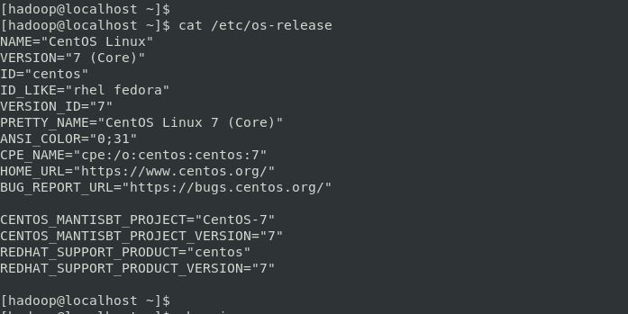

* Login as ROOT user

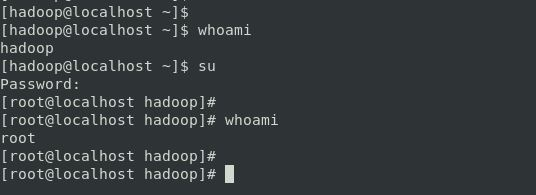

* Update the CentOS: `yum update -y`

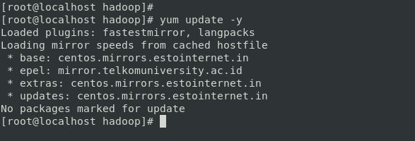

## Docker Installation

### Setting up the yum repository for Docker:

Install the yum-utils package (which provides the yum-config-manager utility) and set up the stable repository.

```
yum install -y yum-utils

yum-config-manager --add-repo https://download.docker.com/linux/centos/docker-ce.repo

```

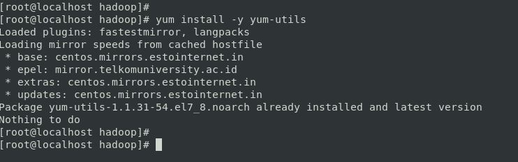

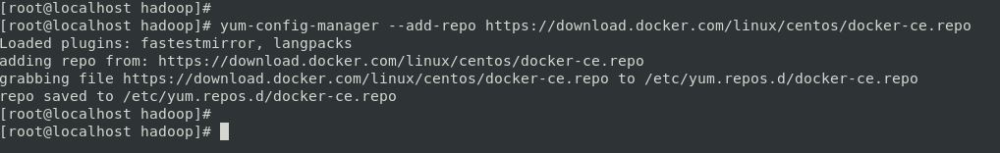

### Install Docker Engine:

* Install the latest version of Docker Engine and containerd:

```
yum install docker-ce docker-ce-cli containerd.io -y
```

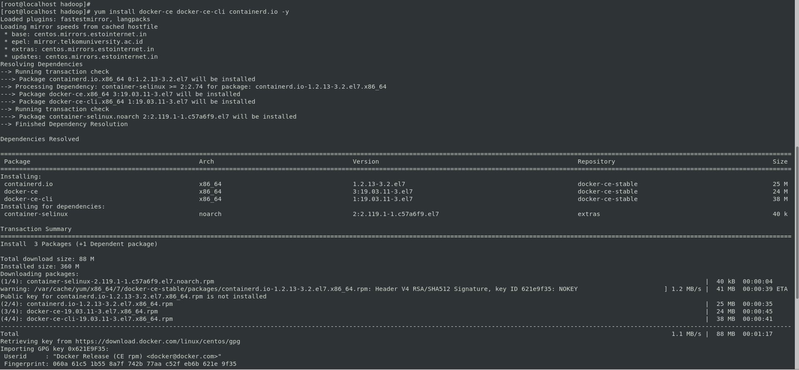

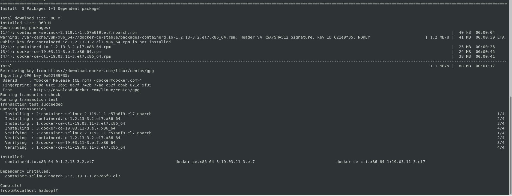

* To install a specific version of Docker Engine, list the available versions in the repo, then select and install:

To get the List of available versions:

```
yum list docker-ce --showduplicates | sort -r
```


To install any specific version:

For example, `docker-ce-18.09.1`

```
yum install docker-ce-<VERSION_STRING> docker-ce-cli-<VERSION_STRING> containerd.io -y
```

Docker is installed but not started. The docker group is created, but no users are added to the group.

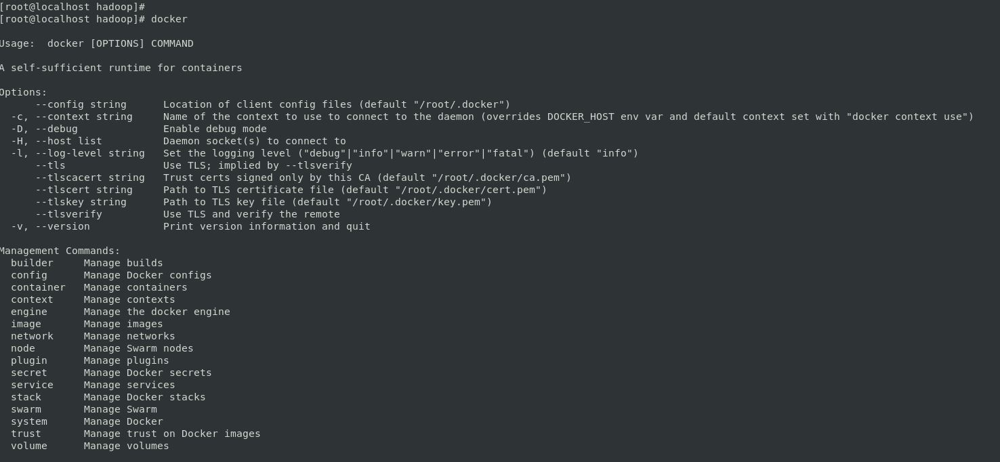

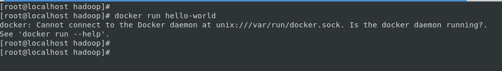

### Starting the Docker Engine:

```
systemctl start docker
```

### Checking the status & version of Docker Engine:

```
systemctl status docker
```

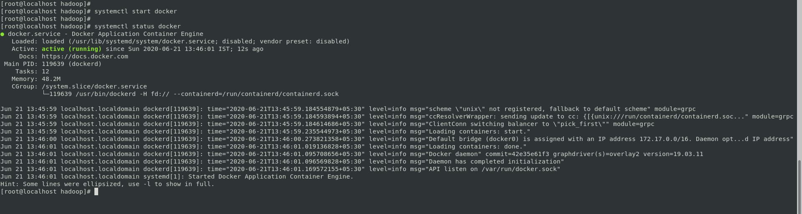

```
docker version
```

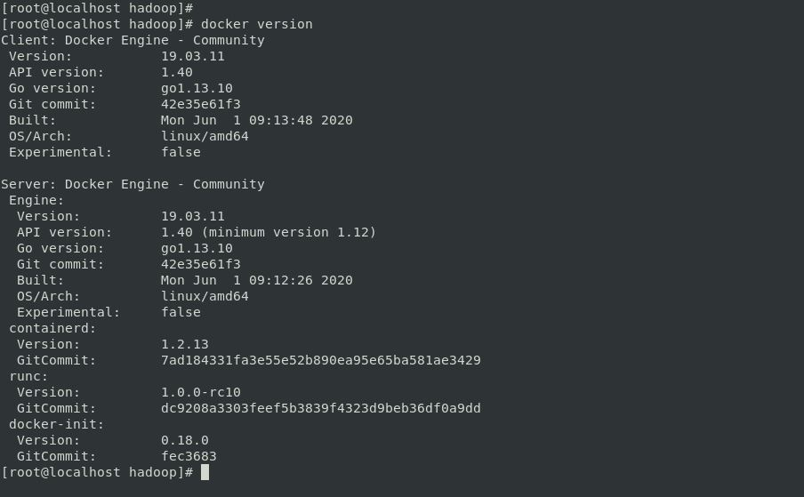

### Verify Installation:

Verify that Docker Engine is installed correctly by running the hello-world image.

```
docker run hello-world
```

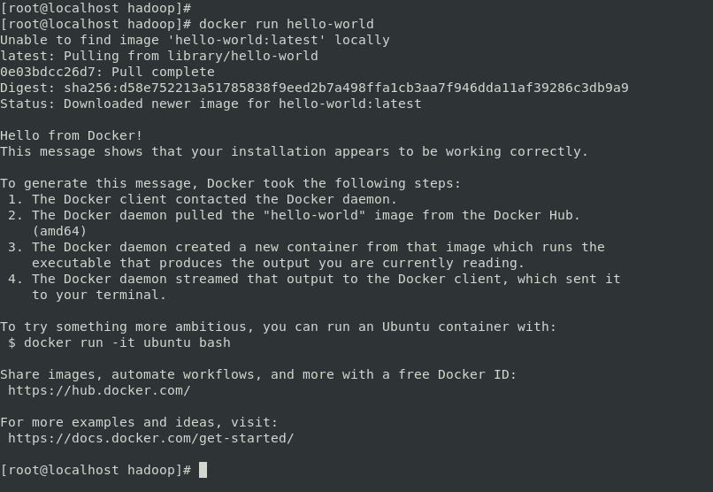

#### References:

1. https://docs.docker.com/engine/install/centos/
