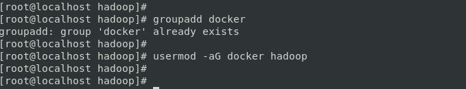
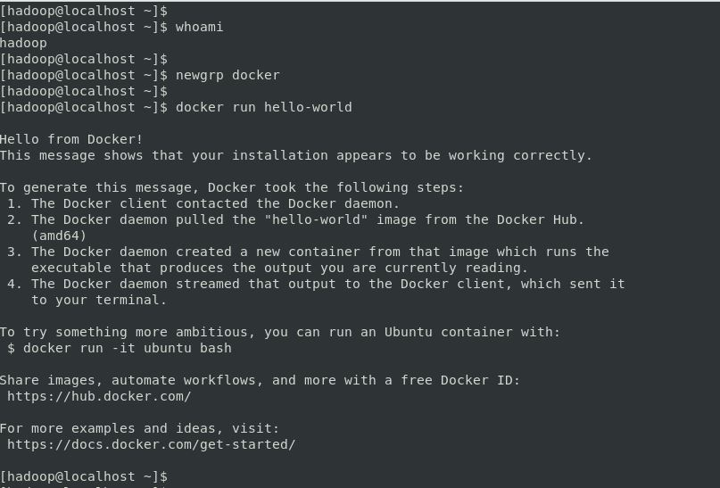
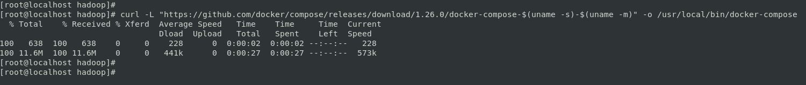
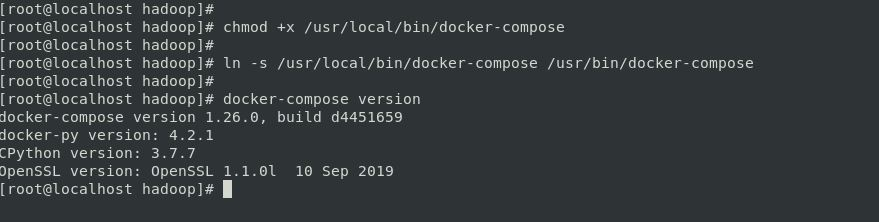

# DOCKER AND DOCKER COMPOSE SETUP ON CENTOS 7

## Pre-requisites

* To install Docker Engine, you need a maintained version of CentOS 7. Archived versions aren’t supported or tested.

* The `centos-extras` repository must be enabled. This repository is enabled by default, but if you have disabled it, you need to re-enable it.

* The `overlay2` storage driver is recommended.


* Login as ROOT `user`


* Update the CentOS: `yum update -y`


## Docker Installation

### Setting up the yum repository for Docker:

Install the `yum-utils` package (which provides the yum-config-manager utility) and set up the stable repository.

```
yum install -y yum-utils

yum-config-manager --add-repo https://download.docker.com/linux/centos/docker-ce.repo

```


### Install Docker Engine:

* Install the latest version of Docker Engine and containerd:

```
yum install docker-ce docker-ce-cli containerd.io -y
```


* To install a specific version of Docker Engine, list the available versions in the repo, then select and install:

To get the List of available versions:

```
yum list docker-ce --showduplicates | sort -r
```


To install any specific version:

For example, `docker-ce-18.09.1`

```
yum install docker-ce-<VERSION_STRING> docker-ce-cli-<VERSION_STRING> containerd.io -y
```

Docker is installed but not started. The docker group is created, but no users are added to the group.


### Starting the Docker Engine:

```
systemctl start docker
```

### Checking the status & version of Docker Engine:

```
systemctl status docker
```


```
docker version
```


### Configuring the Docker to start ob boot:

```
systemctl enable docker
```

### Verify Installation:

Verify that Docker Engine is installed correctly by running the hello-world image.

```
docker run hello-world
```


### Manage Docker as a non-root user

The Docker daemon binds to a Unix socket instead of a TCP port. By default that Unix socket is owned by the user `root` and other users can only access it using `sudo`. The Docker daemon always runs as the `root` user.

If you don’t want to preface the docker command with `sudo`, create a Unix group called `docker` and add users to it. When the Docker daemon starts, it creates a Unix socket accessible by members of the docker group.

#### To create the docker group and add your user:

* Create the docker group.

```
groupadd docker
```

* Add your user to the docker group.

```
usermod -aG docker $USER
```



* Log out and log back in so that your group membership is re-evaluated.

If testing on a virtual machine, it may be necessary to restart the virtual machine for changes to take effect. On a desktop Linux environment such as X Windows, log out of your session completely and then log back in. On Linux, you can also run the following command to activate the changes to groups:

```
newgrp docker
```

Verify that you can run docker commands without sudo.

```
docker run hello-world
```

This command downloads a test image and runs it in a container. When the container runs, it prints an informational message and exits



## Docker Compose Installation

### Pre-requisites

Docker Compose relies on Docker Engine for any meaningful work, so make sure you have Docker Engine installed either locally or remote, depending on your setup.

* On desktop systems like Docker Desktop for Mac and Windows, Docker Compose is included as part of those desktop installs.

* On Linux systems, first install the Docker Engine for your OS as described on the Get Docker page, then come back here for instructions on installing Compose on Linux systems.

* To run Compose as a non-root user.

### Install Docker Compose

On Linux, you can download the Docker Compose binary from the [Compose repository release page on GitHub](https://github.com/docker/compose/releases). Follow the instructions from the link, which involve running the `curl` command in your terminal to download the binaries. These step-by-step instructions are also included below.

* Run this command to download the current stable release of Docker Compose:

```
curl -L "https://github.com/docker/compose/releases/download/1.26.0/docker-compose-$(uname -s)-$(uname -m)" -o /usr/local/bin/docker-compose
```



* Apply executable permissions to the binary:

```
chmod +x /usr/local/bin/docker-compose
```

* Adding `docker-compose` to PATH:

```
ln -s /usr/local/bin/docker-compose /usr/bin/docker-compose
```

* Test the installation:

As `root` user

```
docker-compose --version
```



As `non root`  or `non sudo` user


#### References:

1. https://docs.docker.com/engine/install/centos/
2. https://docs.docker.com/engine/install/linux-postinstall/
3. https://docs.docker.com/compose/install/
4. https://github.com/docker/compose/releases
