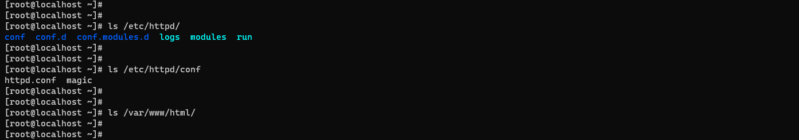

# Setting up Apache HTTPD Server On CentOS 7

#### Pre-requisites

* Root privileges
* Access to Internet
* Web Browser

### Root Login to Server via SSH

```
ssh root@192.168.0.115
```


### Update Packages

```
yum update -y
```


### Install Apache `httpd` Server

```
yum install httpd -y
```


### Apache httpd Server default Home & Document directory



### Configuring Listening Port and Document Directory

```
cat /etc/httpd/conf/httpd.conf
```

```
#
# Listen: Allows you to bind Apache to specific IP addresses and/or
# ports, instead of the default. See also the <VirtualHost>
# directive.
#
# Change this to Listen on specific IP addresses as shown below to
# prevent Apache from glomming onto all bound IP addresses.
#
#Listen 12.34.56.78:80
Listen 80
```


```
#
# DocumentRoot: The directory out of which you will serve your
# documents. By default, all requests are taken from this directory, but
# symbolic links and aliases may be used to point to other locations.
#
DocumentRoot "/var/www/html"
```


### Create a Sample HTML File

```
cat > /var/www/html/index.html
```

```
Hello World!!!

This is the message from Apache Server running on CentOS 7 Virtual Machine
```


### Start & Enable Apache `httpd` Server

```
systemctl status httpd.service
```

```
systemctl start httpd.service
```

```
systemctl enable httpd.service
```

```
systemctl status httpd.service
```


### Adding Firewall Rule to allow http & https requests

```
firewall-cmd --permanent --add-service=http
```

```
firewall-cmd --permanent --add-service=https
```


### Accessing the Web Page

From Browser:


Using CURL:

```
curl http://192.168.0.115
```

