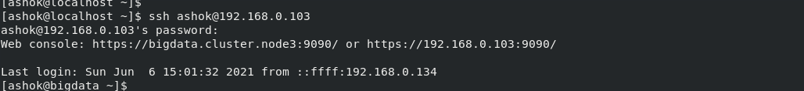
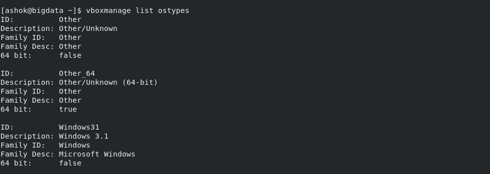

# CREATING A VIRTUAL MACHINE IN REMOTE SERVER USING ORACLE VIRTUALBOX (VBoxManage)

### Introduction

**VBoxManage** is the command-line interface to Oracle VM VirtualBox. With it, you can completely control Oracle VM VirtualBox from the command line of your host operating system. VBoxManage supports all the features that the graphical user interface gives you access to, but it supports a lot more than that. It exposes all the features of the virtualization engine, even those that cannot be accessed from the GUI.

You will need to use the command line if you want to do the following:

- Use a different user interface than the main GUI such as the VBoxHeadless server.

- Control some of the more advanced and experimental configuration settings for a VM.

There are two main things to keep in mind when using VBoxManage. 

- First, VBoxManage must always be used with a specific subcommand, such as list or createvm or startvm. All the subcommands that VBoxManage supports are described [here](https://www.virtualbox.org/manual/ch08.html)

- Second, most of these subcommands require that you specify a particular virtual machine after the subcommand. There are two ways you can do this:

  You can specify the VM name, as it is shown in the Oracle VM VirtualBox GUI. Note that if that name contains spaces, then you must enclose the entire name in double quotes. This is always required with command line arguments that contain spaces.
  
For example:

```
VBoxManage startvm "Windows XP"
```

You can specify the UUID, which is the internal unique identifier that Oracle VM VirtualBox uses to refer to the virtual machine. Assuming that the VM called `Windows XP` has the UUID shown below, the following command has the same effect as the previous example:

```
VBoxManage startvm 670e746d-abea-4ba6-ad02-2a3b043810a5
```

### Challenge

It is easy to install a Virtual Machine with the Oracle VirtualBox GUI, but when it is required to install a VM in Remote Machine with `NO GUI` access.

Now we are going to take this challenge of installing a Virtual Machine using VirtualBox software in a remote machine.

### Pre-requisites

The following are few dependencies for installing a VM in remote machine / server using VirtualBox:

- Virtualization of CPU should be enabled at Host Machine BIOS
- Oracle VM VirtualBox should be installed and VBoxManage should be working
- Oracle VM VirtualBox Extension Pack should be installed
- Remote Desktop client in our local machine (CentOS 8 by default it will have `Remote Desktop Viewer`)

### Virtual Machine Creation

- Login to Remote Server

  ```
  ssh <USER>@<Hostname / IP Address>
  ```
  Example:
  ```
  ssh ashok@192.168.0.103
  ```

  

- Check the VirtualBox Installation

  ```
  vboxmanage --version
  ```

  
  
- Download the ISO file [ubuntu-20.04.2.0-desktop-amd64](https://ubuntu.com/download/desktop)

  ```
  wget https://mirrors.piconets.webwerks.in/ubuntu-mirror/ubuntu-releases/20.04.2.0/ubuntu-20.04.2.0-desktop-amd64.iso
  ```

  

#### Set the path of Virtual Machines

```
# Create directory for Virtual Machines
mkdir "$(echo $HOME)/VirtualBox_VMs/"

vboxmanage setproperty machinefolder "$(echo $HOME)/VirtualBox_VMs/"
```


#### Create a VM and Register it

```
vboxmanage createvm --name "vm1" --register
```


#### Create a vDisk (Virtual Disk for the VM). This file is used by VM as Virtual Disk

```
vboxmanage createvdi --filename ~/VirtualBox_VMs/vm1/vm1-vdisk01.vdi --size 20000
```


**NOTE: (Save the UUID generated for VDI)**

#### List OS Types which are supported by VirtualBox

```
vboxmanage list ostypes
```




**Select the required version, for this example select Ubuntu_64 (Ubuntu-20.04.2.0)**

#### Configure Compute, Networking & Operating system support

```
# Get the Network Adapter
iconfig

vboxmanage modifyvm "vm1" --cpus 2 --memory 4096 --acpi on --boot1 dvd --nic1 bridged --bridgeadapter1 enp0s3 --cableconnected1 on --ostype Ubuntu_64
```


#### Create Storage IDE controller and attach to the VM

```
vboxmanage storagectl "vm1" --name "SATA Controller" --add sata
```


#### Attach the vDisk and the ISO image for Operating System

```
vboxmanage storageattach "vm1" --storagectl "SATA Controller" --port 0 --device 0 --type hdd --medium ~/VirtualBox_VMs/vm1/vm1-vdisk01.vdi

vboxmanage storageattach "vm1" --storagectl "SATA Controller" --port 1 --device 0 --type dvddrive --medium ~/ubuntu-20.04.2.0-desktop-amd64.iso
```


#### Setting up the boot sequence

```
vboxmanage modifyvm "vm1" --boot1 dvd --boot2 disk --boot3 none --boot4 none
```


#### Enabling Nested Virtualization

```
vboxmanage modifyvm "vm1" --nested-hw-virt on
```

#### Enable RDP (Remote Desktop Protocol)

```
vboxmanage modifyvm vm1 --vrde on
vboxmanage modifyvm vm1 --vrdemulticon on --vrdeport 10001
```


#### Start the VM

```
vboxheadless --startvm vm1 &
```


#### Connect to VM using Remote Desktop Client

If you are using CentOS 8, by default you'll get Remote Desktop Viewer.

- Use IP address of HostName and connect
- You can change the Screen Height & Width


THERE YOU GO, WE ARE USING A REMOTE DESKTOP NOW. INSTALL THE OS WITH GUI OPTIONS AND ONCE IT IS DONE. WE CAN CONNECT WITH IT USING SSH CONNECTION.

## ***Cheers & Happy Coding...!!!***

## Next Steps

Next we'll be going to install multiple Virtual Machine on Remote Machine using Oracle VirtualBox using CLI.
We are also going to use these Virtual Machines to install the Bigdata Services like Hadoop, Kafka, Elasticsearch etc 

### References

- VBoxManage - https://www.virtualbox.org/manual/ch08.html
- Remote Desktop Viewer - https://vitux.com/how-to-install-rdp-remote-desktop-on-centos-8/