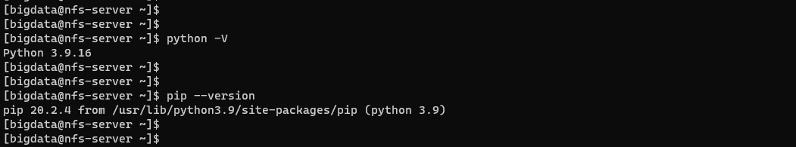
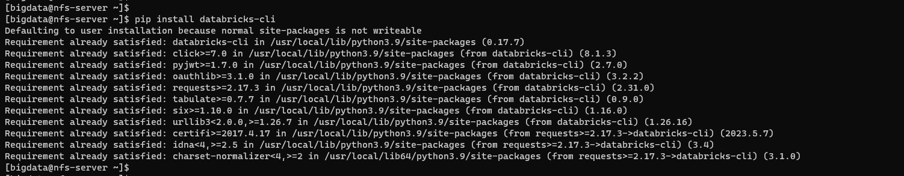
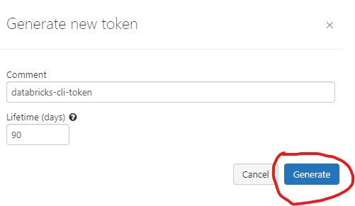
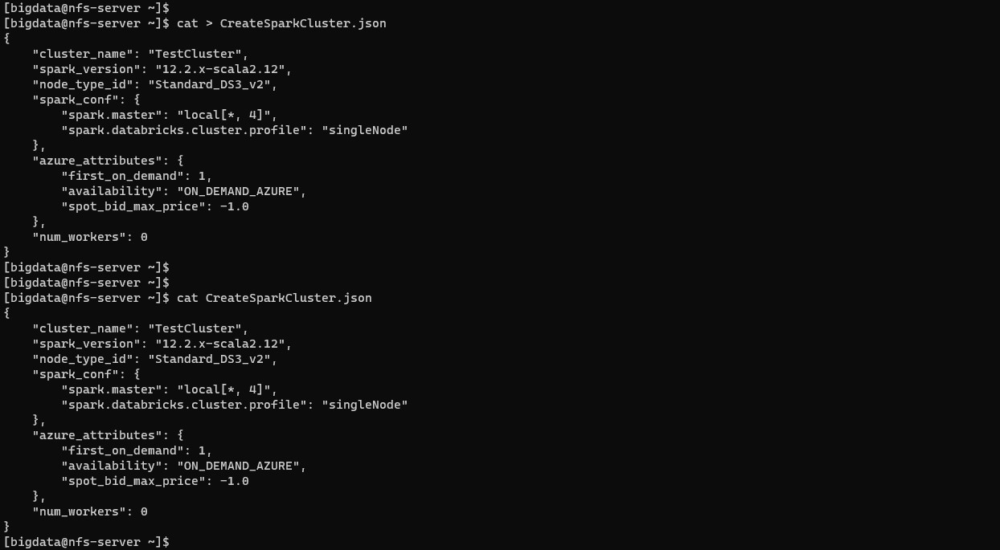

# Setup & Configuration of Databricks CLI on CentOS 8 Stream

## Prerequisites

* Python3
* Pip3

```
python -V

pip --version
```



## Databricks CLI installation

```
pip install databricks-cli
```



## Check databricks cli version

```
databricks --version
```


```
databricks
```


## Generated Databricks Access Token

1. Go to Azure Databricks home page


2. Select the Azure Databricks Service and lick on `Launch Workspace`


3. After redirecting to Azure Databricks UI, click on the `username` and select the `User Settings` option


4. Under User Settings select option to `Generate a New Token`


5. Provide the token name and lifetime and click on generate.



6. Copy the generated token and save it. This token will not be able to access it later


## Get Azure Databricks URL


## Configuring databricks cli using token

```
databricks configure -h
```


```
databricks configure --token
```


## Validate databricks cli

```
databricks fs ls
```


```
databricks fs ls dbfs:/databricks-datasets
```


## Create a Spark Cluster

Create a file `CreateSparkCluster.json` with below content

```
{
    "cluster_name": "TestCluster",
    "spark_version": "12.2.x-scala2.12",
    "node_type_id": "Standard_DS3_v2",
    "spark_conf": {
        "spark.master": "local[*, 4]",
        "spark.databricks.cluster.profile": "singleNode"
    },
    "azure_attributes": {
        "first_on_demand": 1,
        "availability": "ON_DEMAND_AZURE",
        "spot_bid_max_price": -1.0
    },
    "num_workers": 0
}
```

```
cat CreateSparkCluster.json
```



```
databricks cluster create --json-file CreateSparkCluster.json
```


## List the Spark Clusters

```
databricks cluster list
```


## Get Cluster Metadata information

```
databricks clusters get --cluster-id 0602-123524-siuy8fpm
```


```
databricks clusters get --cluster-name 
```


***With this we have the Azure Databricks environment setup ready for writing the Apache Spark Applications using Notebooks***
