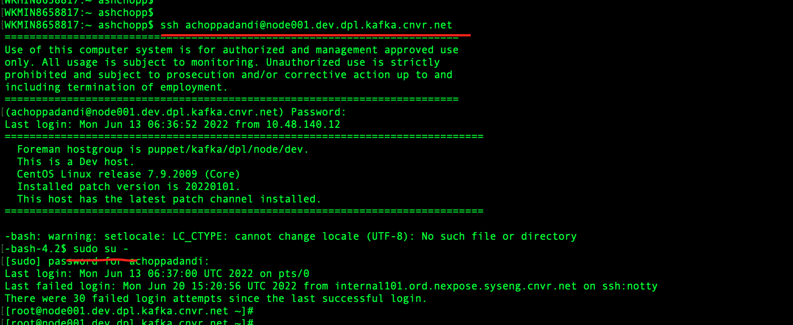
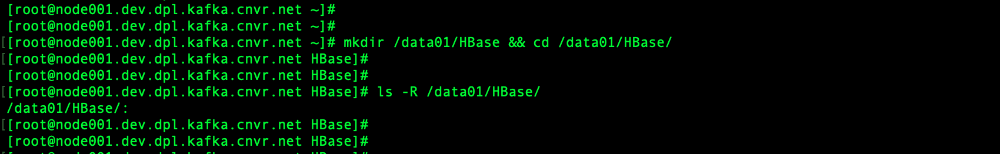
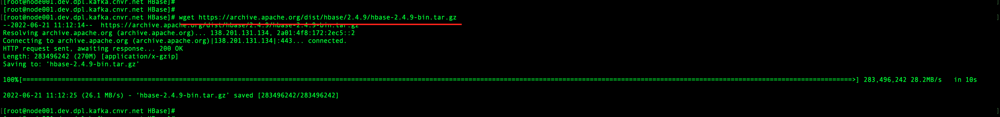
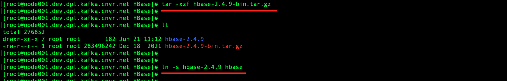
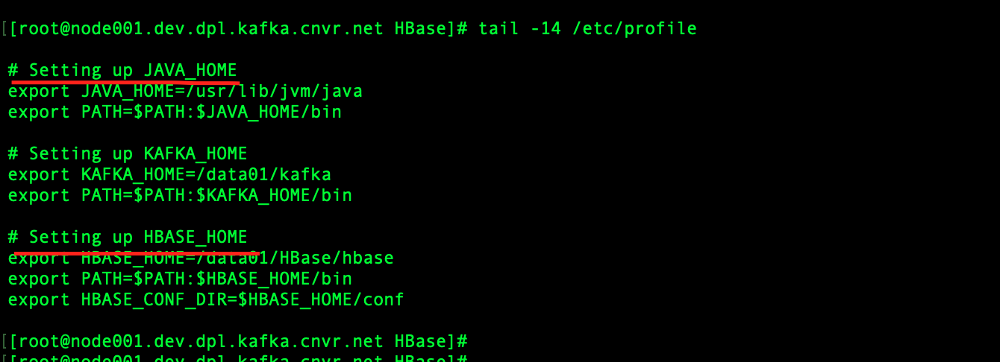
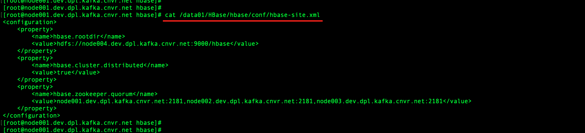
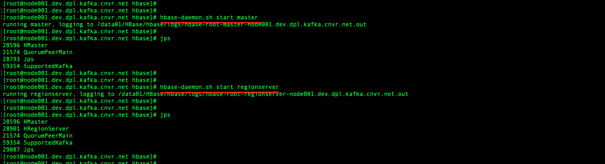

# HBase Installation

### Login to Remote Host

```
ssh achoppadandi@node001.dev.dpl.kafka.cnvr.net

sudo su -
```



### Create HBase Directory

```
mkdir /data01/HBase && cd /data01/HBase/
```



### Pre-requisites

* Java 8

### Download HBase

```
wget https://archive.apache.org/dist/hbase/2.4.9/hbase-2.4.9-bin.tar.gz
```



### Extract HBase

```
tar -xzf hbase-2.4.9-bin.tar.gz
```

### Create Soft Link

```
ln -s hbase-2.4.9 hbase
```



### Setting JAVA_HOME, HBASE_HOME & HBASE_CONF_DIR

```
vi /etc/profile
```

```
# Setting up JAVA_HOME
export JAVA_HOME=/usr/lib/jvm/java
export PATH=$PATH:$JAVA_HOME/bin

# Setting HBASE_HOME
export HBASE_HOME=/data01/HBase/hbase
export PATH=$PATH:$HBASE_HOME/bin
export HBASE_CONF_DIR=$HBASE_HOME/conf
```

```
source /etc/profile
```



### Configuration

#### hbase-site.xml

```
vi /data01/HBase/hbase/conf/hbase-site.xml
```

```
<configuration>
    <property>
        <name>hbase.rootdir</name>
        <value>hdfs://node004.dev.dpl.kafka.cnvr.net:9000/hbase</value>
    </property>
    <property>
        <name>hbase.cluster.distributed</name>
        <value>true</value>
    </property>
    <property>
        <name>hbase.zookeeper.quorum</name>
        <value>node001.dev.dpl.kafka.cnvr.net:2181,node002.dev.dpl.kafka.cnvr.net:2181,node003.dev.dpl.kafka.cnvr.net:2181</value>
    </property>
</configuration>
```



### Start the Services

#### HBase HMaster

```
hbase-daemon.sh start master
```

#### HBase Region Server

```
hbase-daemon.sh start regionserver
```

### Check the process

```
jps
```



#### HBase HMaster

```
http://node001.dev.dpl.kafka.cnvr.net:16010
```

