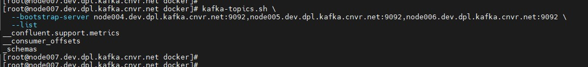
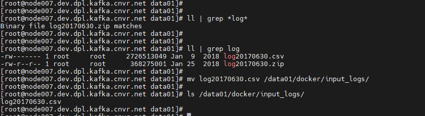

# GEO REPLICATION WITH APACHE KAFKA's MIRROR MAKER V2.0

For this hands-on, the following are the two Kafka Clusters used named as RDC & ORD:

* Cluster A
    * node001.dev.dpl.kafka.cnvr.net
    * node002.dev.dpl.kafka.cnvr.net
    * node003.dev.dpl.kafka.cnvr.net
* Cluster B
    * node004.dev.dpl.kafka.cnvr.net
    * node005.dev.dpl.kafka.cnvr.net
    * node006.dev.dpl.kafka.cnvr.net
* Cluster C
    * node004.dev.dpl.kafka.cnvr.net
    * node005.dev.dpl.kafka.cnvr.net
    * node006.dev.dpl.kafka.cnvr.net
* Edge Node, MM1, MM2 & Monitoring 
    * node007.dev.dpl.kafka.cnvr.net

## List Topics
#### Cluster A - RDC:

```
kafka-topics.sh \
  --bootstrap-server node001.dev.dpl.kafka.cnvr.net:9092,node002.dev.dpl.kafka.cnvr.net:9092,node003.dev.dpl.kafka.cnvr.net:9092 \
  --list
```


#### Cluster B - ORD:

```
kafka-topics.sh \
  --bootstrap-server node004.dev.dpl.kafka.cnvr.net:9092,node005.dev.dpl.kafka.cnvr.net:9092,node006.dev.dpl.kafka.cnvr.net:9092 \
  --list
```



## Cluster A - Topic Creation
#### Create Topic - NginxServerLogs:

```
kafka-topics.sh \
  --bootstrap-server node001.dev.dpl.kafka.cnvr.net:9092,node002.dev.dpl.kafka.cnvr.net:9092,node003.dev.dpl.kafka.cnvr.net:9092 \
  --create \
  --topic NginxServerLogs \
  --partitions 15 \
  --replication-factor 3
```


#### Describe Topic - NginxServerLogs:

```
kafka-topics.sh \
  --bootstrap-server node001.dev.dpl.kafka.cnvr.net:9092,node002.dev.dpl.kafka.cnvr.net:9092,node003.dev.dpl.kafka.cnvr.net:9092 \
  --describe \
  --topic NginxServerLogs
```


## Cluster B - Topic Creation
#### Create Topic - TomcatServerLogs:

```
kafka-topics.sh \
  --bootstrap-server node004.dev.dpl.kafka.cnvr.net:9092,node005.dev.dpl.kafka.cnvr.net:9092,node006.dev.dpl.kafka.cnvr.net:9092 \
  --create \
  --topic TomcatServerLogs \
  --partitions 10 \
  --replication-factor 3
```


#### Describe Topic - TomcatServerLogs:

```
kafka-topics.sh \
  --bootstrap-server node004.dev.dpl.kafka.cnvr.net:9092,node005.dev.dpl.kafka.cnvr.net:9092,node006.dev.dpl.kafka.cnvr.net:9092 \
  --describe \
  --topic TomcatServerLogs
```


## Mirror Maker 2.0 Setup - Active / Active

```
cat /data01/configs/mm2-data-disaster-recovery.properties
```

```
clusters=ClusterA, ClusterB
ClusterA.bootstrap.servers=node001.dev.dpl.kafka.cnvr.net:9092,node002.dev.dpl.kafka.cnvr.net:9092,node003.dev.dpl.kafka.cnvr.net:9092
ClusterB.bootstrap.servers=node004.dev.dpl.kafka.cnvr.net:9092,node005.dev.dpl.kafka.cnvr.net:9092,node006.dev.dpl.kafka.cnvr.net:9092

#ClusterA and ClusterB configurations. Default value for the following settings is 3.
#If you want more details about those internal configurations, please see https://docs.confluent.io/home/connect/userguide.html#kconnect-internal-topics
#and https://docs.confluent.io/platform/current/connect/references/allconfigs.html#distributed-worker-configuration
ClusterA.config.storage.replication.factor=3
ClusterB.config.storage.replication.factor=3

ClusterA.offset.storage.replication.factor=3
ClusterB.offset.storage.replication.factor=3

ClusterA.status.storage.replication.factor=3
ClusterB.status.storage.replication.factor=3

ClusterA->ClusterB.enabled=true
ClusterB->ClusterA.enabled=true

# MirrorMaker configuration. Default value for the following settings is 3
offset-syncs.topic.replication.factor=3
heartbeats.topic.replication.factor=3
checkpoints.topic.replication.factor=3

topics=.*
groups=.*

tasks.max=30
replication.factor=3
refresh.topics.enabled=true
sync.topic.configs.enabled=true
refresh.topics.interval.seconds=30

topics.blacklist=.*[\-\.]internal, .*\.replica, __consumer_offsets
groups.blacklist=console-consumer-.*, connect-.*, __.*

# Enable heartbeats and checkpoints
ClusterA->ClusterB.emit.heartbeats.enabled=true
ClusterA->ClusterB.emit.checkpoints.enabled=true
ClusterB->ClusterA.emit.heartbeats.enabled=true
ClusterB->ClusterA.emit.checkpoints.enabled=true
```


#### MM2 Service Script With JMX Exporter:

```
cat /etc/systemd/system/connect-mirror-maker.service
```

```
[Unit]
Description=Setup Kafka Mirror Maker Service

[Service]
User=root
Group=root
Environment="KAFKA_LOG4J_OPTS=-Dlog4j.configuration=file:/data01/confluent/etc/kafka/connect-log4j.properties"
Environment="KAFKA_HEAP_OPTS=-Xms1G -Xmx8G"
Environment="KAFKA_OPTS=-javaagent:/data01/jmx_exporter/jmx_prometheus_javaagent-0.15.0.jar=8095:/data01/jmx_exporter/kafka-connect.yaml"
ExecStart=/data01/confluent/bin/connect-mirror-maker /data01/configs/mm2-data-disaster-recovery.properties
SuccessExitStatus=143

[Install]
WantedBy=multi-user.target
```


#### Start the MM2 as a Service:

Reload:

```
systemctl daemon-reload
```

Start the Service:

```
systemctl start connect-mirror-maker.service
```

Status Check:

```
systemctl status connect-mirror-maker.service
```


## Produce Data

A docker image is created to read the data from the given input directory which is mounted as a volume to the docker container.

The following is the docker image: ashokkumarchoppadandi/edgar-logs-kafka-producer:1.0-SNAPSHOT

Two docker containers are launched using the below docker-compose file:

```
cat /data01/docker/docker-compose-logs-producer.yaml
```

```
version: '3.5'

networks:
  adserver:
    name: adserver
    driver: bridge

services:
  nginx-logs-producer:
    image: ashokkumarchoppadandi/edgar-logs-kafka-producer:1.0-SNAPSHOT
    hostname: nginx-logs-producer
    container_name: nginx-logs-producer
    networks:
      - adserver
    environment:
      BOOTSTRAP_SERVERS: PLAINTEXT:\/\/node001.dev.dpl.kafka.cnvr.net:9092,PLAINTEXT:\/\/node002.dev.dpl.kafka.cnvr.net:9092,PLAINTEXT:\/\/node003.dev.dpl.kafka.cnvr.net:9092
      ACKS: all
      RETRIES: 0
      BATCH_SIZE: 16384
      LINGER_MS: 1
      BUFFER_MEMORY: 33554432
      KEY_SERIALIZER: org.apache.kafka.common.serialization.StringSerializer
      VALUE_SERIALIZER: org.apache.kafka.common.serialization.StringSerializer
      OUTPUT_FORMAT: csv
      TOPIC_NAME: NginxServerLogs
      INPUT_LOGS_DIR: \/edgar\/input_logs\/
      IS_CONFIGURING_PROPERTIES_REQUIRED: "yes"
      IS_KERBEROS_AUTHENTICATION_REQUIRED: "no"
      JAR_FILE_LOCATION: /java_examples/
      JAR_NAME: KafkaExamples-1.0-SNAPSHOT.jar
      RUN_CLASS: com.bigdata.kafka.producer.file.dynamic.EdgarLogsKafkaDynamicFileProducer
    volumes:
      - ./input_logs/:/edgar/input_logs/:rw

  tomcat-logs-producer:
    image: ashokkumarchoppadandi/edgar-logs-kafka-producer:1.0-SNAPSHOT
    hostname: tomcat-logs-producer
    container_name: tomcat-logs-producer
    networks:
      - adserver
    environment:
      BOOTSTRAP_SERVERS: PLAINTEXT:\/\/node004.dev.dpl.kafka.cnvr.net:9092,PLAINTEXT:\/\/node005.dev.dpl.kafka.cnvr.net:9092,PLAINTEXT:\/\/node006.dev.dpl.kafka.cnvr.net:9092
      ACKS: all
      RETRIES: 0
      BATCH_SIZE: 16384
      LINGER_MS: 1
      BUFFER_MEMORY: 33554432
      KEY_SERIALIZER: org.apache.kafka.common.serialization.StringSerializer
      VALUE_SERIALIZER: org.apache.kafka.common.serialization.StringSerializer
      OUTPUT_FORMAT: csv
      TOPIC_NAME: TomcatServerLogs
      INPUT_LOGS_DIR: \/edgar\/input_logs\/
      IS_CONFIGURING_PROPERTIES_REQUIRED: "yes"
      IS_KERBEROS_AUTHENTICATION_REQUIRED: "no"
      JAR_FILE_LOCATION: /java_examples/
      JAR_NAME: KafkaExamples-1.0-SNAPSHOT.jar
      RUN_CLASS: com.bigdata.kafka.producer.file.dynamic.EdgarLogsKafkaDynamicFileProducer
    volumes:
      - ./input_logs/:/edgar/input_logs/:rw
```

NOTE: The above docker-compose file will spin up two docker containers which reads data from the input directory which is mounted as a volume to the docker container. Each docker container produces its message to a different topic in different clusters.


Starting the container:

```
cd /data01/docker/ && docker-compose -f docker-compose-logs-producer.yaml up -d
```

Status Check:

```
docker-compose -f /data01/docker/docker-compose-logs-producer.yaml ps -a
```


#### Input Data

For this example, an online data set is being used just to generate some bigdata. The log file `log20170630.csv` can be downloaded from the below link:

https://www.sec.gov/dera/data/edgar-log-file-data-set.html

The file will be downloaded as a Zip file. Just unzip the file and place the file in the directory that is mounted as volume to the docker container.

```
wget http://www.sec.gov/dera/data/Public-EDGAR-log-file-data/2017/Qtr2/log20170630.zip
```

```
unzip log20170630.zip
```


```
ll | grep log
```

```
mv log20170630.csv /data01/docker/input_logs/
```



The data is ingested into both the Kafka Topics NginxServerLogs on Cluster A and TomcatServerLogs on Cluster B by the docker containers.

* Cluster A by docker container:

    

* Mirror Maker 2.0 Metrics:

    

* Cluster B by Mirror Maker 2.0 Processes:

    

## Shutting down Cluster B - Deleting everything

### Stopping the Kafka Broker Services

On Broker node004:

```
systemctl stop kafka.service
```

On Broker node005:

```
systemctl stop kafka.service
```

```
systemctl stop schema-registry.service
```

On Broker node006:

```
systemctl stop kafka.service
```

### Deleting all the Kafka Data

On Broker node004:

```
rm -rf /data01/data/kafka
```

On Broker node005:

```
rm -rf /data01/data/kafka
```

On Broker node006:

```
rm -rf /data01/data/kafka
```

### Deleting the Kafka ZNodes from Zookeeper Quorum

On Zookeeper node004:

```
zookeeper-shell.sh node004.dev.dpl.kafka.cnvr.net:2181 ls /

zookeeper-shell.sh node004.dev.dpl.kafka.cnvr.net:2181 deleteall /kafka
```

### Changes on Grafana Dashboard

As all the Kafka Brokers are shutdown, there are no metrics available in Grafana


Mirror Maker Metrics:


## Starting a NEW Cluster C

On Broker node004:

```
systemctl start kafka.service
```

On Broker node005:

```
systemctl start kafka.service
```

```
systemctl start schema-registry.service
```

On Broker node006:

```
systemctl start kafka.service
```


## Disaster Recovery with MM2

To recover the data from the Existing Kafka Cluster, the MM2 service needs to be restarted with the new configuration properties.

### New Config File for MM2

```
cat /data01/configs/mm2-data-disaster-recovery-new.properties
```

```
clusters=ClusterA, ClusterC
ClusterA.bootstrap.servers=node001.dev.dpl.kafka.cnvr.net:9092,node002.dev.dpl.kafka.cnvr.net:9092,node003.dev.dpl.kafka.cnvr.net:9092
ClusterC.bootstrap.servers=node004.dev.dpl.kafka.cnvr.net:9092,node005.dev.dpl.kafka.cnvr.net:9092,node006.dev.dpl.kafka.cnvr.net:9092

#ClusterA and ClusterC configurations. Default value for the following settings is 3.
#If you want more details about those internal configurations, please see https://docs.confluent.io/home/connect/userguide.html#kconnect-internal-topics
#and https://docs.confluent.io/platform/current/connect/references/allconfigs.html#distributed-worker-configuration
ClusterA.config.storage.replication.factor=3
ClusterC.config.storage.replication.factor=3

ClusterA.offset.storage.replication.factor=3
ClusterC.offset.storage.replication.factor=3

ClusterA.status.storage.replication.factor=3
ClusterC.status.storage.replication.factor=3

ClusterA->ClusterC.enabled=true
ClusterC->ClusterA.enabled=true

# MirrorMaker configuration. Default value for the following settings is 3
offset-syncs.topic.replication.factor=3
heartbeats.topic.replication.factor=3
checkpoints.topic.replication.factor=3

topics=.*
groups=.*

tasks.max=30
replication.factor=3
refresh.topics.enabled=true
sync.topic.configs.enabled=true
refresh.topics.interval.seconds=30

topics.blacklist=.*[\-\.]internal, .*\.replica, __consumer_offsets
groups.blacklist=console-consumer-.*, connect-.*, __.*

# Enable heartbeats and checkpoints
ClusterA->ClusterC.emit.heartbeats.enabled=true
ClusterA->ClusterC.emit.checkpoints.enabled=true
ClusterC->ClusterA.emit.heartbeats.enabled=true
ClusterC->ClusterA.emit.checkpoints.enabled=true
```


### Update MM2 Service Script

```
cat /etc/systemd/system/connect-mirror-maker.service
```

```
[Unit]
Description=Setup Kafka Mirror Maker Service

[Service]
User=root
Group=root
Environment="KAFKA_LOG4J_OPTS=-Dlog4j.configuration=file:/data01/confluent/etc/kafka/connect-log4j.properties"
Environment="KAFKA_HEAP_OPTS=-Xms1G -Xmx8G"
Environment="KAFKA_OPTS=-javaagent:/data01/jmx_exporter/jmx_prometheus_javaagent-0.15.0.jar=8095:/data01/jmx_exporter/kafka-connect.yaml"
ExecStart=/data01/confluent/bin/connect-mirror-maker /data01/configs/mm2-data-disaster-recovery-new.properties
SuccessExitStatus=143

[Install]
WantedBy=multi-user.target

```


### Start the MM2 as a Service:

Reload:

```
systemctl daemon-reload
```

Start the Service:

```
systemctl start connect-mirror-maker.service
```

Status Check:

```
systemctl status connect-mirror-maker.service
```


## Disaster Recovery on Grafana Dashboard

Now the topics data which are available on Cluster A are recovered and inserted into Kafka Topics on Cluster C


Note: The Kafka Topic on Cluster C i.e., `ClusterA.ClusterB.TomcatServerLogs` is the Kafka Topic earlier on Cluster B which was totally lost but it is recovered with the help of MM2
