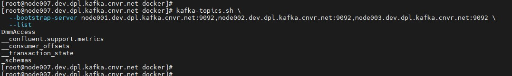

# GEO REPLICATION WITH APACHE KAFKA's MIRROR MAKER V2.0

For this hands-on, the following are the two Kafka Clusters used named as RDC & ORD:

* RDC - (Cluster A)
    * node001.dev.dpl.kafka.cnvr.net
    * node002.dev.dpl.kafka.cnvr.net
    * node003.dev.dpl.kafka.cnvr.net
* ORD - (Cluster B)
    * node004.dev.dpl.kafka.cnvr.net
    * node005.dev.dpl.kafka.cnvr.net
    * node006.dev.dpl.kafka.cnvr.net

## List Topics
#### Cluster A - RDC:

```
kafka-topics.sh \
  --bootstrap-server node001.dev.dpl.kafka.cnvr.net:9092,node002.dev.dpl.kafka.cnvr.net:9092,node003.dev.dpl.kafka.cnvr.net:9092 \
  --list
```



#### Cluster B - ORD:

```
kafka-topics.sh \
  --bootstrap-server node004.dev.dpl.kafka.cnvr.net:9092,node005.dev.dpl.kafka.cnvr.net:9092,node006.dev.dpl.kafka.cnvr.net:9092 \
  --list
```


## Cluster A - Topic Creation
#### Create Topic - DmmAccess:

```
kafka-topics.sh \
  --bootstrap-server node001.dev.dpl.kafka.cnvr.net:9092,node002.dev.dpl.kafka.cnvr.net:9092,node003.dev.dpl.kafka.cnvr.net:9092 \
  --create \
  --topic DmmAccess \
  --partitions 6 \
  --replication-factor 3
```


#### Describe Topic - DmmAccess:

```
kafka-topics.sh \
  --bootstrap-server node001.dev.dpl.kafka.cnvr.net:9092,node002.dev.dpl.kafka.cnvr.net:9092,node003.dev.dpl.kafka.cnvr.net:9092 \
  --describe \
  --topic DmmAccess
```


#### Create Topic - apache-logs:

```
kafka-topics.sh \
  --bootstrap-server node001.dev.dpl.kafka.cnvr.net:9092,node002.dev.dpl.kafka.cnvr.net:9092,node003.dev.dpl.kafka.cnvr.net:9092 \
  --create \
  --topic apache-logs \
  --partitions 15 \
  --replication-factor 3
```


#### Describe Topic - apache-logs:

```
kafka-topics.sh \
  --bootstrap-server node001.dev.dpl.kafka.cnvr.net:9092,node002.dev.dpl.kafka.cnvr.net:9092,node003.dev.dpl.kafka.cnvr.net:9092 \
  --describe \
  --topic apache-logs
```


## Mirror Maker 2.0 Setup
#### MM2 Config Properties File:

```
cat /data01/configs/mm2-data-replication.properties
```

```
# Basic Settings
clusters = rdc, ord
rdc.bootstrap.servers = node001.dev.dpl.kafka.cnvr.net:9092,node002.dev.dpl.kafka.cnvr.net:9092,node003.dev.dpl.kafka.cnvr.net:9092
ord.bootstrap.servers = node004.dev.dpl.kafka.cnvr.net:9092,node005.dev.dpl.kafka.cnvr.net:9092,node006.dev.dpl.kafka.cnvr.net:9092

# Kafka Connect Configurations
rdc.config.storage.replication.factor=3
ord.config.storage.replication.factor=3

rdc.offset.storage.replication.factor=3
ord.offset.storage.replication.factor=3

rdc.status.storage.replication.factor=3
ord.status.storage.replication.factor=3

tasks.max = 20
replication.factor = 3
refresh.topics.enabled=true
sync.topic.configs.enabled=true
refresh.topics.interval.seconds=30

rdc->ord.emit.heartbeats.enabled=true
rdc->ord.emit.checkpoints.enabled=true

# Define replication flows
rdc->ord.enabled = true
rdc->ord.topics = apache-logs,DmmAccess

# MirrorMaker configuration. Default value for the following settings is 3
offset-syncs.topic.replication.factor=3
heartbeats.topic.replication.factor=3
checkpoints.topic.replication.factor=3

# source cluster over writes
rdc.max.poll.records = 20000
rdc.receive.buffer.bytes = 33554432
rdc.send.buffer.bytes = 33554432
rdc.max.partition.fetch.bytes = 33554432
rdc.message.max.bytes = 37755000
rdc.compression.type = gzip
rdc.max.request.size = 26214400
rdc.buffer.memory = 524288000
rdc.batch.size = 524288

# destination cluster over writes
ord.max.poll.records = 20000
ord.receive.buffer.bytes = 33554432
ord.send.buffer.bytes = 33554432
ord.max.partition.fetch.bytes = 33554432
ord.message.max.bytes = 37755000
ord.compression.type = gzip
ord.max.request.size = 26214400
ord.buffer.memory = 524288000
ord.batch.size = 524288

topics.blacklist=.*[\-\.]internal, .*\.replica, __consumer_offsets
groups.blacklist=console-consumer-.*, connect-.*, __.*
```


#### MM2 Service Script With JMX Exporter:

```
cat /etc/systemd/system/connect-mirror-maker.service
```

```
[Unit]
Description=Setup Kafka Mirror Maker Service

[Service]
User=root
Group=root
Environment="KAFKA_LOG4J_OPTS=-Dlog4j.configuration=file:/data01/confluent/etc/kafka/connect-log4j.properties"
Environment="KAFKA_HEAP_OPTS=-Xms1G -Xmx8G"
Environment="KAFKA_OPTS=-javaagent:/data01/jmx_exporter/jmx_prometheus_javaagent-0.15.0.jar=8095:/data01/jmx_exporter/kafka-connect.yaml"
ExecStart=/data01/confluent/bin/connect-mirror-maker /data01/configs/mm2-data-replication-new.properties
SuccessExitStatus=143

[Install]
WantedBy=multi-user.target
```


#### Start the MM2 as a Service:

Reload:

```
systemctl daemon-reload
```

Start the Service:

```
systemctl start connect-mirror-maker.service
```

Status Check:

```
systemctl status connect-mirror-maker.service
```


## Produce Data

#### Topic - DmmAccess

Some sample amounts of Flume data is being redirected to the Cluster A (RDC)

#### Topic apache-logs

A docker image is created to read the data from the given input directory which is mounted as a volume to the docker container.

The following is the docker image: ashokkumarchoppadandi/edgar-logs-kafka-producer:1.0-SNAPSHOT

The docker container is launched using the below docker-compose file:

```
cat /data01/docker/docker-compose-apache-logs-producer.yaml
```

```
version: '3.5'

networks:
  adserver:
    name: adserver
    driver: bridge

services:
  apache-logs-producer:
    image: ashokkumarchoppadandi/edgar-logs-kafka-producer:1.0-SNAPSHOT
    hostname: apache-logs-producer
    container_name: apache-logs-producer
    networks:
      - adserver
    environment:
      BOOTSTRAP_SERVERS: PLAINTEXT:\/\/node001.dev.dpl.kafka.cnvr.net:9092,PLAINTEXT:\/\/node002.dev.dpl.kafka.cnvr.net:9092,PLAINTEXT:\/\/node003.dev.dpl.kafka.cnvr.net:9092
      ACKS: all
      RETRIES: 0
      BATCH_SIZE: 16384
      LINGER_MS: 1
      BUFFER_MEMORY: 33554432
      KEY_SERIALIZER: org.apache.kafka.common.serialization.StringSerializer
      VALUE_SERIALIZER: org.apache.kafka.common.serialization.StringSerializer
      OUTPUT_FORMAT: csv
      TOPIC_NAME: apache-logs
      INPUT_LOGS_DIR: \/edgar\/input_logs\/
      IS_CONFIGURING_PROPERTIES_REQUIRED: "yes"
      IS_KERBEROS_AUTHENTICATION_REQUIRED: "no"
      JAR_FILE_LOCATION: /java_examples/
      JAR_NAME: KafkaExamples-1.0-SNAPSHOT.jar
      RUN_CLASS: com.bigdata.kafka.producer.file.dynamic.EdgarLogsKafkaDynamicFileProducer
    volumes:
      - ./input_logs/:/edgar/input_logs/:rw
```


Starting the container:

```
cd /data01/docker/ && docker-compose -f docker-compose-apache-logs-producer.yaml up -d
```

Status Check:

```
docker-compose -f /data01/docker/docker-compose-apache-logs-producer.yaml ps -a
```


#### Input Data

For this example, an online data set is being used just to generate some bigdata. The log file `log20170630.csv` can be downloaded from the below link:

https://www.sec.gov/dera/data/edgar-log-file-data-set.html

The file will be downloaded as a Zip file. Just unzip the file and place the file in the directory that is mounted as volume to the docker container.

```
wget http://www.sec.gov/dera/data/Public-EDGAR-log-file-data/2017/Qtr2/log20170630.zip
```

```
unzip log20170630.zip
```


```
ll | grep log
```

```
mv log20170630.csv /data01/docker/input_logs/
```


The data is ingested in the Kafka Topic apache-logs on Cluster A by the docker container.

* Cluster A by docker container:

    

* Mirror Maker 2.0 Metrics:

    

* Cluster B by Mirror Maker 2.0 Processes:

    


This concludes the Geo Replication of Data from One Kafka Cluster to Another Kafka Cluster.