# NFS SETUP FOR KUBERNETES VOLUMES

## Pre-requisites

* Linux Server (VM / Remote Server) - CentOS 8 Stream - 192.168.
* Root privileges

## Setup

### Login to CentOS 8 Stream server as `root` user

```
ssh root@192.168.0.51
```

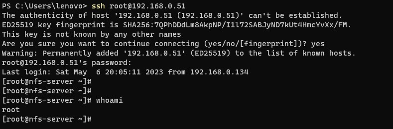

### Update Packages

```
dnf update -y
```

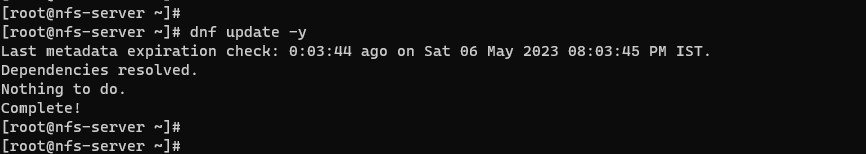

### Install `nfs-utils`

```
dnf install nfs-utils -y
```

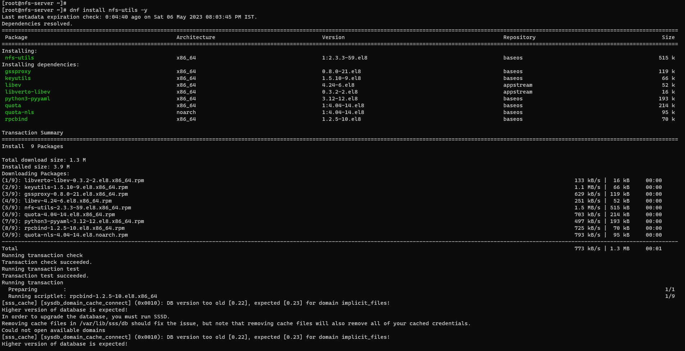

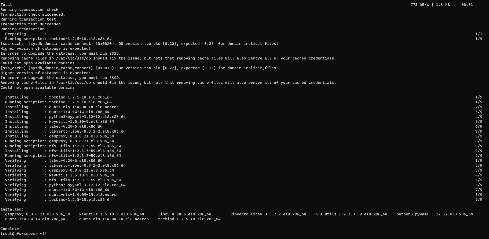

### Start the `nfs-server`

```
systemctl start nfs-server.service
```

### Enable the `nfs-server` to start at boot time

```
systemctl enable nfs-server.service
```

### Check the status of `nfs-server`

```
systemctl status nfs-server.service
```

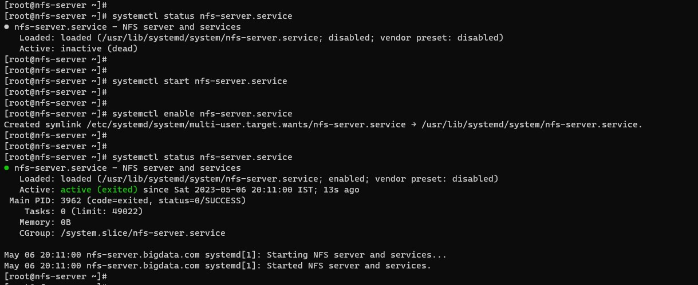

### Create the shared directory

```
mkdir -p /mnt/share/data
```

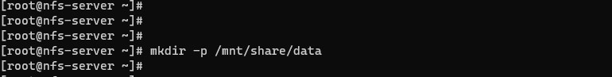

### Change the owner to `nobody` and provide all permissions

```
chown -R nobody: /mnt/share/data/

chmod -R 777 /mnt/share/data/

ls -ltr /mnt/share/
```

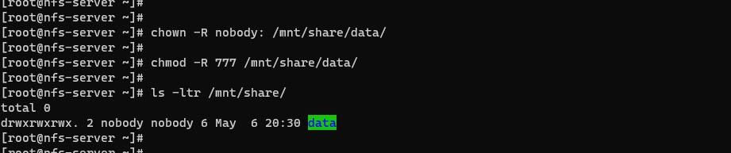

### Export the shared directory to the nfs clients

#### Add shared directory to `/etc/exports`

```
cat /etc/exports
```

Add the below line to `/etc/exports`

```
/mnt/share/data *(rw,sync,no_subtree_check,no_all_squash,no_root_squash,insecure)
```

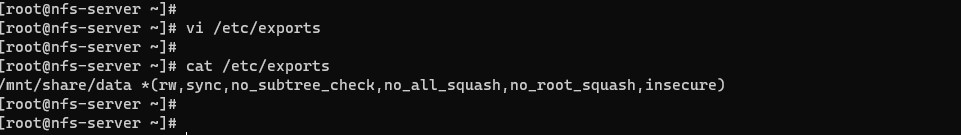

#### Export shared directory and check the status

```
exportfs -arv

exportfs -s

exportfs
```

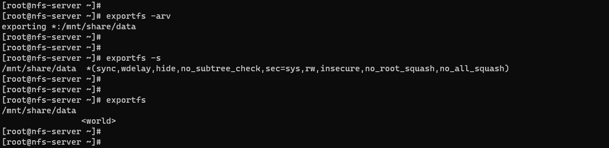

### Allow nfs through the firewall

```
firewall-cmd --permanent --add-service=nfs

firewall-cmd --permanent --add-service=rpc-bind

firewall-cmd --permanent --add-service=mountd

firewall-cmd --reload
```

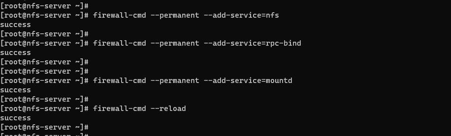

### Check RPC info

```
rpcinfo -p | grep nfs
```

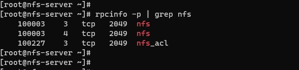


## Now we have an NFS server running with a shared directory at `/mnt/share/data` on ip address `192.168.0.51` which is exposed to the world.

## ***Cheers & Happy Coding...!!!***