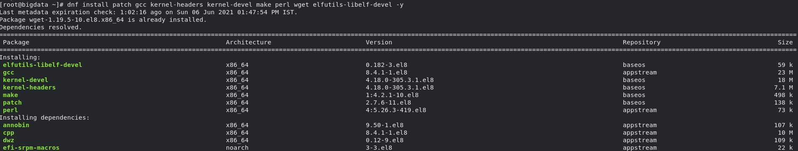
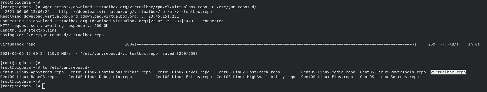

# ORACLE VIRTUALBOX INSTALLATION ON CENTOS 8 USING CLI

### Introduction

VirtualBox is a powerful x86 and AMD64/Intel64 virtualization product for enterprise as well as home use. Not only is VirtualBox an extremely feature rich, high performance product for enterprise customers, it is also the only professional solution that is freely available as Open Source Software under the terms of the GNU General Public License (GPL) version 2.

[Click Here](https://www.virtualbox.org/) for more details

### Challenge

It is very easy to install Oracle VirtualBox in any system using the Graphical User Interface (GUI), but the real challenge is installing it on a Remote machine with no GUI access.

Full documentation of Oracle VirtualBox is available [here](https://www.virtualbox.org/manual/UserManual.html).

Now we are going to take the challenge of installing fully functional VirtualBox software in a remote machine.

### Pre-requisites

The following are few of the pre-requisites which are needed to set up Oracle VirtualBox on a remote machine.

1. Remote Machine IP Address / Hostname which is running on CentOS 8

2. `sudo` OR `root` user access to remote machine

3. SSH client to login

### Installation Steps

For this example, I'm going to use a CentOS 8 machine which is running my local network with the IP Address - `192.168.0.102`

1. Check the machine accessible or not by pinging the server / machine
   
```
ping 192.168.0.103   
```


2. Login to Remote machine as `root` or `sudo` user.

```
ssh root@192.168.0.103
```


3. Check the OS Type and Version

```
uanme -a

cat /etc/redhat-release
```


4. Update remote machine OS packages and dependencies

```
dnf update -y
```


5. Install the required packages for Oracle VM VirtualBox

```
dnf install patch gcc kernel-headers kernel-devel make perl wget elfutils-libelf-devel -y
```



6. Reboot the system

```
reboot
```


Pinging the Server again


Logging in again as Root user


7. Add / Download the Oracle Virtual Box repo on CentOS 8 machine

   - Create a file in /etc/yum.repos.d directory like below 
     
        `vi /etc/yum.repos.d/virtualbox.repo`
     
   - Then add the below content to the [File](https://download.virtualbox.org/virtualbox/rpm/el/virtualbox.repo)
      ```
   	  [virtualbox]
   	  name=Oracle Linux / RHEL / CentOS-$releasever / $basearch - VirtualBox
   	  baseurl=http://download.virtualbox.org/virtualbox/rpm/el/$releasever/$basearch
   	  enabled=1
   	  gpgcheck=1
   	  repo_gpgcheck=1
   	  gpgkey=https://www.virtualbox.org/download/oracle_vbox.asc
      ```

   - Save the file.

   ( OR )

   As an alternate just run the below command which downloads the file from VirtualBox download repo page and save it in `/etc/yum.repos.d`
      ```
      wget https://download.virtualbox.org/virtualbox/rpm/el/virtualbox.repo -P /etc/yum.repos.d/
      ```
   

8. Install Oracle Virtual Box 

```
dnf install VirtualBox-6.1 -y
```


9. Check the Status

```
systemctl status vboxdrv.service
```


10. Start the service at boot time (if not already done by default)

```
systemctl enable vboxdrv.service
```

11. Download the Oracle VM VirtualBox extension pack from [here](https://www.virtualbox.org/wiki/Downloads)

```
wget https://download.virtualbox.org/virtualbox/6.1.22/Oracle_VM_VirtualBox_Extension_Pack-6.1.22.vbox-extpack
```


12. Install extension pack

```
vboxmanage	extpack install ./Oracle_VM_VirtualBox_Extension_Pack-6.1.22.vbox-extpack
```


13. Validate the installation with few of the below commands:

```
vboxmanage --version

vboxmanage list vms

vboxmanage list ostypes
```


***Optional***
-
13. To uninstall / remove VirtualBox

```
dnf remove VirtualBox-6.1 -y
```

## ***Cheers & Happy Coding...!!!***

## Next Steps

Next we'll be going to see the Virtual Machine installation on Remote Machine using Oracle VirtualBox using CLI

### References

- https://www.virtualbox.org/wiki/Downloads
- https://www.virtualbox.org/manual/UserManual.html#intro-installing