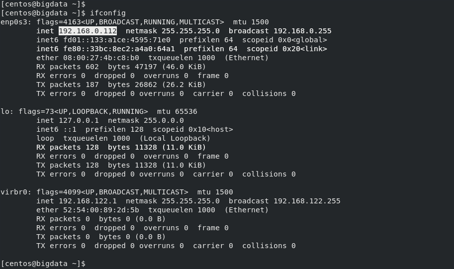
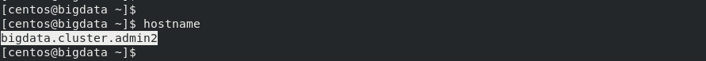
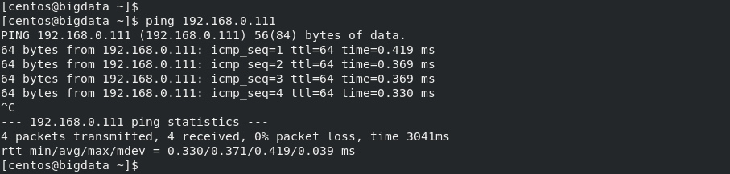
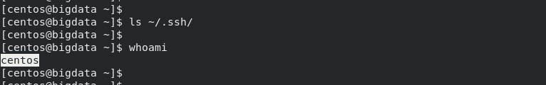
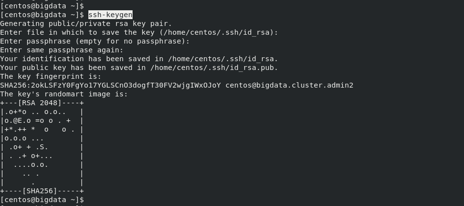
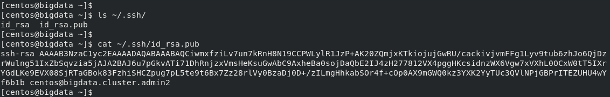
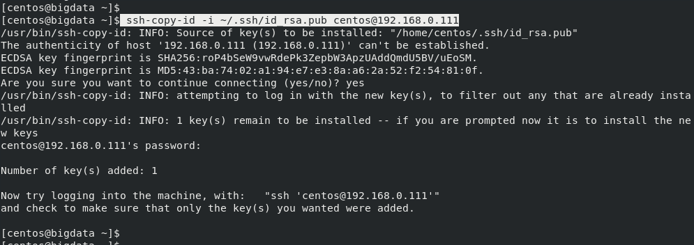
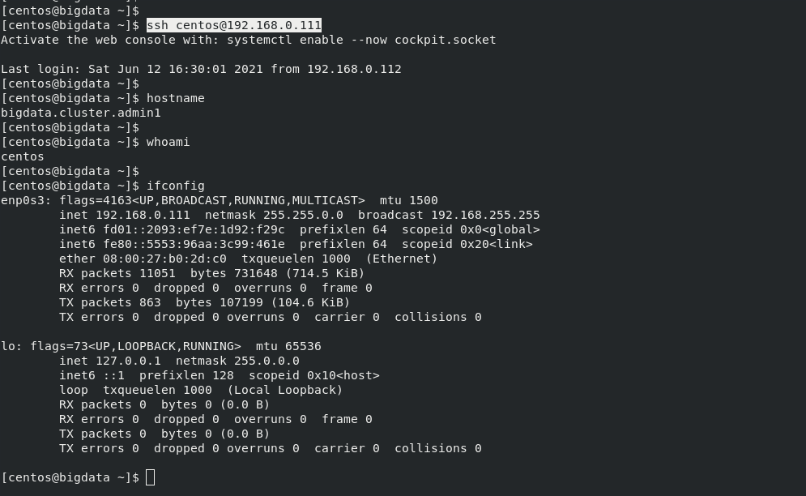

# PASSWORD LESS LOGIN TO A REMOTE SERVER

#### Introduction

Password less login is technique which uses the User's public to SSH a Remote Server. This will not always prompt for the password. The Password Less Login is helpful for the application which want to do SSH into a Remote Server and do some operation automatically without prompting for user password.

#### Pre-requisites

- Remote Server IP Address or Hostname
- Username / User to Login as
- Public Key of the User

#### Setting Up Password Less Login

In this example, we are going to connect to remote machine which is running in the Local environment.

Client IP Address: ``
Remote Server: `192.168.0.111`

- Client Machine IP and Hostname:

  Client Machine IP Address is - `192.168.0.112`
  Client Machine Hostname is - `bigdata.cluster.admin2`

  ```
  [centos@bigdata ~]$ 
  [centos@bigdata ~]$ ifconfig
  enp0s3: flags=4163<UP,BROADCAST,RUNNING,MULTICAST>  mtu 1500
  inet 192.168.0.112  netmask 255.255.255.0  broadcast 192.168.0.255
  inet6 fd01::133:a1ce:4595:71e0  prefixlen 64  scopeid 0x0<global>
  inet6 fe80::33bc:8ec2:a4a0:64a1  prefixlen 64  scopeid 0x20<link>
  ether 08:00:27:4b:c8:b0  txqueuelen 1000  (Ethernet)
  RX packets 602  bytes 47197 (46.0 KiB)
  RX errors 0  dropped 0  overruns 0  frame 0
  TX packets 187  bytes 26862 (26.2 KiB)
  TX errors 0  dropped 0 overruns 0  carrier 0  collisions 0
  
  lo: flags=73<UP,LOOPBACK,RUNNING>  mtu 65536
  inet 127.0.0.1  netmask 255.0.0.0
  inet6 ::1  prefixlen 128  scopeid 0x10<host>
  loop  txqueuelen 1000  (Local Loopback)
  RX packets 128  bytes 11328 (11.0 KiB)
  RX errors 0  dropped 0  overruns 0  frame 0
  TX packets 128  bytes 11328 (11.0 KiB)
  TX errors 0  dropped 0 overruns 0  carrier 0  collisions 0
  
  virbr0: flags=4099<UP,BROADCAST,MULTICAST>  mtu 1500
  inet 192.168.122.1  netmask 255.255.255.0  broadcast 192.168.122.255
  ether 52:54:00:89:2d:5b  txqueuelen 1000  (Ethernet)
  RX packets 0  bytes 0 (0.0 B)
  RX errors 0  dropped 0  overruns 0  frame 0
  TX packets 0  bytes 0 (0.0 B)
  TX errors 0  dropped 0 overruns 0  carrier 0  collisions 0
  
  [centos@bigdata ~]$
  [centos@bigdata ~]$ hostname
  bigdata.cluster.admin2
  [centos@bigdata ~]$
  ```

  
  
  

- Check Remote Server:

  Remote Server IP Address is - `192.168.0.111`
  Check whether the server is up or not with command - `ping 192.168.0.111`
  
  ```
  [centos@bigdata ~]$ 
  [centos@bigdata ~]$ ping 192.168.0.111
  PING 192.168.0.111 (192.168.0.111) 56(84) bytes of data.
  64 bytes from 192.168.0.111: icmp_seq=1 ttl=64 time=0.419 ms
  64 bytes from 192.168.0.111: icmp_seq=2 ttl=64 time=0.369 ms
  64 bytes from 192.168.0.111: icmp_seq=3 ttl=64 time=0.369 ms
  64 bytes from 192.168.0.111: icmp_seq=4 ttl=64 time=0.330 ms
  ^C
  --- 192.168.0.111 ping statistics ---
  4 packets transmitted, 4 received, 0% packet loss, time 3041ms
  rtt min/avg/max/mdev = 0.330/0.371/0.419/0.039 ms
  [centos@bigdata ~]$
  ```
  
  

- Check the SSH Keys:
    
  SSH Keys will be under the home directory of the User (ex: centos)

  ```
  [centos@bigdata ~]$ 
  [centos@bigdata ~]$ ls ~/.ssh/
  [centos@bigdata ~]$
  [centos@bigdata ~]$ whoami
  centos
  [centos@bigdata ~]$
  ```

  

- Generate SSH Keys:

  ```
  [centos@bigdata ~]$ ssh-keygen 
  Generating public/private rsa key pair.
  Enter file in which to save the key (/home/centos/.ssh/id_rsa):
  Enter passphrase (empty for no passphrase):
  Enter same passphrase again:
  Your identification has been saved in /home/centos/.ssh/id_rsa.
  Your public key has been saved in /home/centos/.ssh/id_rsa.pub.
  The key fingerprint is:
  SHA256:2okLSFzY0FgYo17YGLSCnO3dogfT30FV2wjgIWxOJoY centos@bigdata.cluster.admin2
  The key's randomart image is:
  +---[RSA 2048]----+
  |.o+*o .. o.o..   |
  |o.@E.o =o o . +  |
  |+*.++ *  o   o . |
  |o.o.o ...        |
  | .o+ + .S.       |
  | . .+ o+...      |
  |  ....o.o.       |
  |    .. .         |
  |      .          |
  +----[SHA256]-----+
  [centos@bigdata ~]$
  ```

  

  ```
  [centos@bigdata ~]$ 
  [centos@bigdata ~]$ ls ~/.ssh/
  id_rsa  id_rsa.pub
  [centos@bigdata ~]$
  [centos@bigdata ~]$ cat ~/.ssh/id_rsa.pub
  ssh-rsa AAAAB3NzaC1yc2EAAAADAQABAAABAQCiwmxfziLv7un7kRnH8N19CCPWLylR1JzP+AK20ZQmjxKTkiojujGwRU/cackivjvmFFg1Lyv9tub6zhJo6QjDzrWulng51IxZbSqvzia5jA
  JA2BAJ6u7pGkvATi71DhRnjzxVmsHeKsuGwAbC9AxheBa0sojDaQbE2IJ4zH277812VX4pggHKcsidnzWX6Vgw7xVXhL0OCxW0tT5IXrYGdLKe9EVX08SjRTaGBok83FzhiSHCZpug7
  pL5te9t6Bx7Zz28rlVy0BzaDj0D+/zILmgHhkabSOr4f+cOp0AX9mGWQ0kz3YXK2YyTUc3QVlNPjGBPrITEZUHU4wYf6b1b centos@bigdata.cluster.admin2
  [centos@bigdata ~]$
  ```

  

- Add SSH Key to Remote Server:

  NOTE: This will prompt for Password for the FIRST time.

  ```
  [centos@bigdata ~]$ 
  [centos@bigdata ~]$ ssh-copy-id -i ~/.ssh/id_rsa.pub centos@192.168.0.111
  /usr/bin/ssh-copy-id: INFO: Source of key(s) to be installed: "/home/centos/.ssh/id_rsa.pub"
  The authenticity of host '192.168.0.111 (192.168.0.111)' can't be established.
  ECDSA key fingerprint is SHA256:roP4bSeW9vwRdePk3ZepbW3ApzUAddQmdU5BV/uEoSM.
  ECDSA key fingerprint is MD5:43:ba:74:02:a1:94:e7:e3:8a:a6:2a:52:f2:54:81:0f.
  Are you sure you want to continue connecting (yes/no)? yes
  /usr/bin/ssh-copy-id: INFO: attempting to log in with the new key(s), to filter out any that are already installed
  /usr/bin/ssh-copy-id: INFO: 1 key(s) remain to be installed -- if you are prompted now it is to install the new keys
  centos@192.168.0.111's password:
  
  Number of key(s) added: 1
  
  Now try logging into the machine, with:   "ssh 'centos@192.168.0.111'"
  and check to make sure that only the key(s) you wanted were added.
  
  [centos@bigdata ~]$
  ```

  

- Check Password Less Login:

  ```
  [centos@bigdata ~]$ 
  [centos@bigdata ~]$ ssh centos@192.168.0.111
  Activate the web console with: systemctl enable --now cockpit.socket
  
  Last login: Sat Jun 12 16:30:01 2021 from 192.168.0.112
  [centos@bigdata ~]$
  [centos@bigdata ~]$ hostname
  bigdata.cluster.admin1
  [centos@bigdata ~]$
  [centos@bigdata ~]$ whoami
  centos
  [centos@bigdata ~]$
  [centos@bigdata ~]$ ifconfig
  enp0s3: flags=4163<UP,BROADCAST,RUNNING,MULTICAST>  mtu 1500
  inet 192.168.0.111  netmask 255.255.0.0  broadcast 192.168.255.255
  inet6 fd01::2093:ef7e:1d92:f29c  prefixlen 64  scopeid 0x0<global>
  inet6 fe80::5553:96aa:3c99:461e  prefixlen 64  scopeid 0x20<link>
  ether 08:00:27:b0:2d:c0  txqueuelen 1000  (Ethernet)
  RX packets 11051  bytes 731648 (714.5 KiB)
  RX errors 0  dropped 0  overruns 0  frame 0
  TX packets 863  bytes 107199 (104.6 KiB)
  TX errors 0  dropped 0 overruns 0  carrier 0  collisions 0
  
  lo: flags=73<UP,LOOPBACK,RUNNING>  mtu 65536
  inet 127.0.0.1  netmask 255.0.0.0
  inet6 ::1  prefixlen 128  scopeid 0x10<host>
  loop  txqueuelen 1000  (Local Loopback)
  RX packets 0  bytes 0 (0.0 B)
  RX errors 0  dropped 0  overruns 0  frame 0
  TX packets 0  bytes 0 (0.0 B)
  TX errors 0  dropped 0 overruns 0  carrier 0  collisions 0
  
  [centos@bigdata ~]$
  ```

  

### ***We have successfully able to login to remote server without entering a password***

## ***Cheers & Happy Coding...!!!***