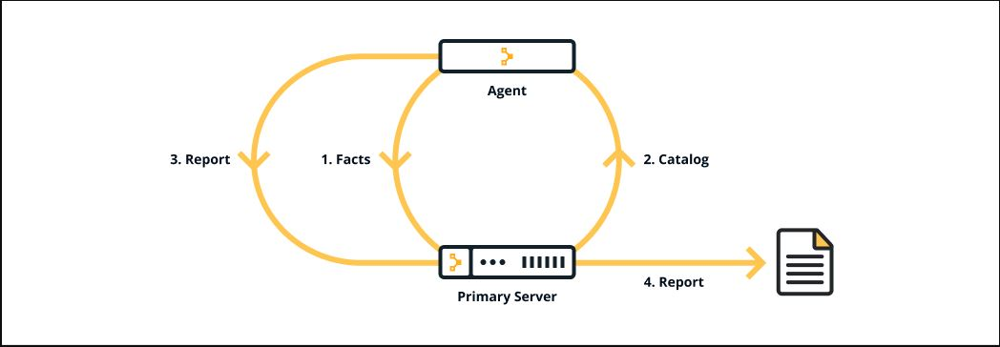

# PUPPET

## What is Puppet?

Puppet is a tool that helps you manage and automate the configuration of servers.

When you use Puppet, you define the desired state of the systems in your infrastructure that you want to manage. You do this by writing infrastructure code in Puppet's `Domain-Specific Language (DSL)` — `Puppet Code` — which you can use with a wide array of devices and operating systems. Puppet code is declarative, which means that you describe the desired state of your systems, not the steps needed to get there. Puppet then automates the process of getting these systems into that state and keeping them there. Puppet does this through `Puppet` primary server and a `Puppet agent`. The `Puppet` primary server is the server that stores the code that defines your desired state. The `Puppet agent` translates your code into commands and then executes it on the systems you specify, in what is called a `Puppet run`.



## Why use Puppet desired state management?

There are many benefits to implementing a declarative configuration tool like Puppet into your environment — most notably:
- Consistency : Across all the Servers & Environments
- Automation : Manage servers at scale like 10s, 100s & 1000s.

## Key concepts behind Puppet 

Using Puppet is not just about the tool, but also about a different culture and a way of working. The following concepts and practices are key to using and being successful with Puppet.

- Infrastructure-as-code
- Idempotency
- Aglie Methodology
- Git and Version Control

## The Puppet Platform

`Puppet` is made up of several packages. Together these are called the `Puppet platform`, which is what you use to manage, store and run your Puppet code. These packages include `puppetserver`, `puppetdb`, and `puppet-agent` — which includes `Facter` and `Hiera`.

Puppet is configured in an `agent-server` architecture, in which a `primary node` (system) controls configuration information for one or more managed agent nodes. Servers and agents communicate by `HTTPS` using `SSL certificates`. Puppet includes a built-in certificate authority for managing certificates.

- `Puppet Server` performs the role of the primary node and also runs an agent to configure itself.

- `Facter`, Puppet’s inventory tool, gathers facts about an agent node such as its hostname, IP address, and operating system. The agent sends these facts to the primary server in the form of a special Puppet code file called a `manifest`. This is the information the primary server uses to compile a `catalog` — a JSON document describing the `desired state` of a specific agent node. Each agent requests and receives its own individual catalog and then enforces that desired state on the node it's running on. The `Puppet Agent` sends a report back to the primary server.

- Puppet code is stored in the form of `manifests`, in modules. Each `module` manages a specific task in your infrastructure, such as installing and configuring a piece of software. Modules contain both code and data. The data is what allows you to customize your configuration. Using a tool called `Hiera`, you can separate the data from the code and place it in a centralized location.

- All of the data generated by Puppet (for example facts, catalogs, reports) is stored in the `Puppet database (PuppetDB)`. Storing data in PuppetDB allows Puppet to work faster and provides an API for other applications to access Puppet's collected data. Once PuppetDB is full of your data, it becomes a great tool for infrastructure discovery, compliance reporting, vulnerability assessment, and more. You perform all of these tasks with PuppetDB queries.

## Installing Puppet

Puppet is distributed in several packages. These include `puppetserver`, `puppet-agent` and `puppetdb`. Puppet Server controls the configuration information for one or more managed agent nodes. PuppetDB is where the data generated by Puppet is stored.

### Java support

Puppet Server versions are tested against the following versions of Java:

```
Puppet Server               Java

6.y and later	            8, 11

7.y and later	            8, 11
```

Install Java - OpenJDK 8

```
sudo yum update -y

sudo yum install java-1.8.0-openjdk-devel -y
```

### Disable firewall

```
sudo systemctl stop firewalld.service

sudo systemctl disable firewalld.service
```

### Add hosts

On Puppet Server machine:

```
sudo vi /etc/hosts
```

```
192.168.0.155   puppetmaster    node105.bigdata.com
```

On Puppet Agent machine:

```
sudo vi /etc/hosts
```

```
192.168.0.155   puppetmaster    node105.bigdata.com
192.168.0.153   puppetagent3    node103.bigdata.com
```

### Enabling the Puppet platform repository

Repositores can be found at : https://yum.puppetlabs.com

```
$ sudo rpm -Uvh https://yum.puppet.com/puppet6-release-el-7.noarch.rpm
```

### Installing Puppet Server

```
$ sudo yum install puppetserver -y
```

NOTE: Open a new shell, or use exec bash to update your PATH.

To check if you installed the Puppet Server correctly, run: 

```
$ puppetserver -v
```

### Puppet Server and puppet.conf settings

#### Configuring puppet.conf

```
sudo vi /etc/puppetlabs/puppet/puppet.conf
```

```
# This file can be used to override the default puppet settings.
# See the following links for more details on what settings are available:
# - https://puppet.com/docs/puppet/latest/config_important_settings.html
# - https://puppet.com/docs/puppet/latest/config_about_settings.html
# - https://puppet.com/docs/puppet/latest/config_file_main.html
# - https://puppet.com/docs/puppet/latest/configuration.html
[server]
vardir = /opt/puppetlabs/server/data/puppetserver
logdir = /var/log/puppetlabs/puppetserver
rundir = /var/run/puppetlabs/puppetserver
pidfile = /var/run/puppetlabs/puppetserver/puppetserver.pid
codedir = /etc/puppetlabs/code
dns_alt_names = puppetmaster

[main]
certname = puppetmaster
server = puppetmaster
emvironment = development
runinterval = 10m
```

#### Running Puppet Server on a VM

By default, Puppet Server is configured to use 2GB of RAM. However, if you want to experiment with Puppet Server on a VM, you can safely allocate as little as 512MB of memory. To change the Puppet Server memory allocation, you can edit the init config file.

```
sudo vi /etc/sysconfig/puppetserver
```

Update the following line to display the amount of memory you want to allocate to Puppet Server:

```
# Modify this if you'd like to change the memory allocation, enable JMX, etc
JAVA_ARGS="-Xms2g -Xmx2g"
```

## Setting up the CA 

```
sudo puppetserver ca setup
```

## Opening the puppet port

```
sudo firewall-cmd --permanent --add-port=8140/tcp
```


## Start the Puppet Server & agent services

```
sudo systemctl start puppetserver.service

sudo systemctl enable puppetserver.service
```


### Installing Puppet agent

NOTE: Puppet platform repository should be enabled on the Agents machine.

```
$ sudo rpm -Uvh https://yum.puppet.com/puppet6-release-el-7.noarch.rpm
```

```
sudo yum install puppet-agent -y
```

Start the Puppet Service:

```
sudo /opt/puppetlabs/bin/puppet resource service puppet ensure=running enable=true
```

#### Configure agents 

Once agents are installed, we must complete the following three configuration steps:

1. Configure your PATH to access Puppet commands

    Source a script that `puppet-agent` installs. Run the following command:

    ```
    source /etc/profile.d/puppet-agent.sh
    ```

    To add the bin directory to your PATH on *nix, run: 
    
    ```
    export PATH=/opt/puppetlabs/bin:$PATH
    ```

    or Add the above line to /etc/profile or ~/.bash_profile

2. Configure the `Server` setting

    The server is setting, which allows you to connect the agent to the primary Puppet server, is the only mandatory setting.

    You can add configuration to agents by using the `puppet config` set sub-command, which edits `puppet.conf` automatically, or editing `/etc/puppetlabs/puppet/puppet.conf` directly.

    To configure the server setting, choose from one of the following options:

    * On the agent node, run:
    
        ```
        puppet config set server puppetserver.example.com --section main
        ```

    * Manually edit 
    
        ```
        sudo vi /etc/puppetlabs/puppet/puppet.conf
        ```

        ```
        [main]
        certname = puppetagent3
        server = puppetmaster
        environment = development
        runinterval = 10m
        ```
3. Start Puppet Agent service

    ```
    sudo /opt/puppetlabs/bin/puppet resource service puppet ensure=running enable=true
    ```

4. Connect the agent to the primary server and sign the certificate

    To connect the agent to the primary server, run: On host ***Puppet Agent / 192.168.0.153 / node103.bigdata.com***

    ```
    sudo /opt/puppetlabs/bin/puppet ssl bootstrap
    ```

    On the primary server node, sign the certificate: On host ***Puppet Master / 192.168.0.155 / node105.bigdata.com***

    ```
    sudo /opt/puppetlabs/bin/pupperserver ca sign --certname puppetagent3
    ```

    On the agent node, run the agent again:
    
    ```
    sudo /opt/puppetlabs/bin/puppet ssl bootstrap
    ```

    Restart the Puppet Agent:

    ```
    sudo systemctl restart puppet.service
    ```

## Revoking CA Certificates

### On Puppet Master:

#### To get the list of certificates:

```
sudo /opt/puppetlabs/bin/puppetserver ca list --all
```

#### To get the list of pending certificates:

```
sudo /opt/puppetlabs/bin/puppetserver ca list
```

#### To revoke a certificate:

```
sudo /opt/puppetlabs/bin/puppetserver ca revoke --certname puppetagent3
```

#### To clean / delete a certificate:

```
sudo /opt/puppetlabs/bin/puppetserver ca clean --certname puppetagent3
```

### On Puppet Agent Machine

Remove the keys (public & private) generated:

```
sudo rm -rf /etc/puppetlabs/puppet/ssl
```

Generate Puppet Agent certificate sign in request:

```
sudo /opt/puppetlabs/bin/puppet ssl bootstrap
```

On the primary server node, sign the certificate: On host ***Puppet Master / 192.168.0.155 / node105.bigdata.com***

```
sudo /opt/puppetlabs/bin/puppetserver ca sign --certname puppetagent3
```

On the agent node, run the agent again:
    
```
sudo /opt/puppetlabs/bin/puppet ssl bootstrap
```

Restart the Puppet Agent:

```
sudo systemctl restart puppet.service
```

## Setting up r10K

### Install r10K

```
/opt/puppetlabs/puppet/bin/gem install r10k
```

### Add r10k to PATH

```
echo "export PUPPET_HOME=/opt/puppetlabs" >> /etc/profile
echo "export PATH=$PATH:$PUPPET_HOME/bin:$PUPPET_HOME/puppet/bin" >> /etc/profile

source /etc/profile
```

### Configuring r10k to GitHub repository

NOTE: Create repository `control-repo` in GitHub, create branch with name `production` and make it is a `default` branch. Delete the `master` branch, becuase `Puppet / r10k` will not work with the `master` branch.

#### Create r10k directory

```
mkdir /opt/puppetlabs/r10k
```

#### Create r10k.yaml configuration file

```
vi /opt/puppetlabs/r10k/r10k.yaml
```

Add the following configuration to `r10k.yaml`

```
---
:cachedir: '/var/cache/r10k'

:sources: 
    :my-org:
        remote: 'https://github.com/AshokKumarChoppadandi/control_repo.git'
        baseurl: '/etc/puppetlabs/code/environments'
```

#### Deploy the repository to the Puppet Master

```
r10k deploy environment -p
```