# Python 3 Installation on CentOS 8 Stream

## Prerequisites
* `root` or `sudo` privileges

## Installation Steps

### Login to the CentOS 8 Stream Server

```
ssh root@192.168.0.51
```

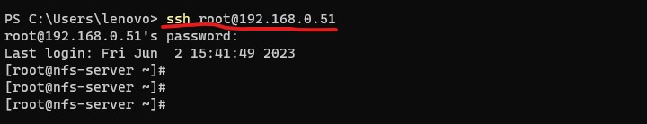

### Update the OS / Packages

```
dnf update -y
```

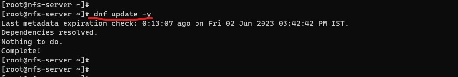

### Install Python 3.9

```
dnf module install python39 -y
```

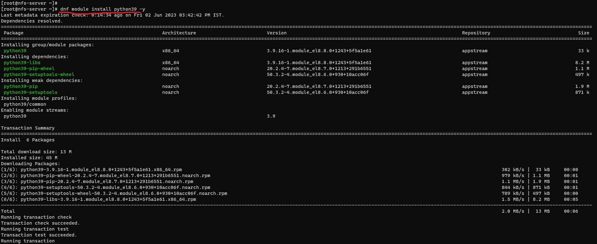


### Check Python3 version

```
python3 -V
```

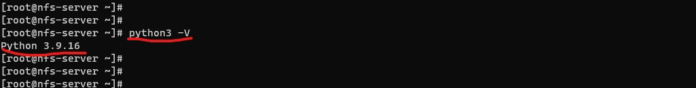

### Check Atlernatives 

```
alternatives --config python3
```

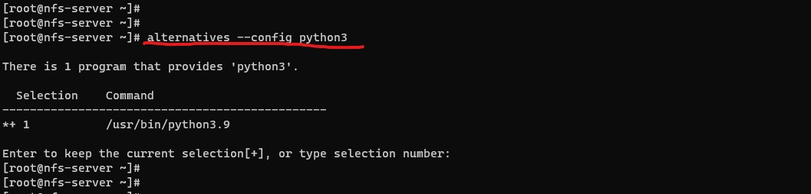

### Making Python3.9 as default

```
alternatives --config python
```

Select the number assigned to `/usr/bin/python3.9`

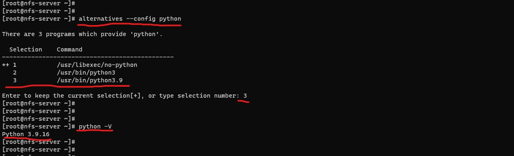

### Pip3 Installation

pip3 will be automatically installed while installing the Python 3

To check the pip3 version

```
pip3 --version
```

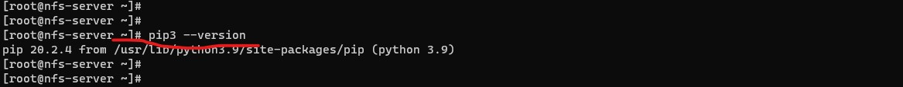

Create a soft link to use `pip3` as `pip`

```
ln -s /usr/bin/pip3 /usr/bin/pip

pip --version
```

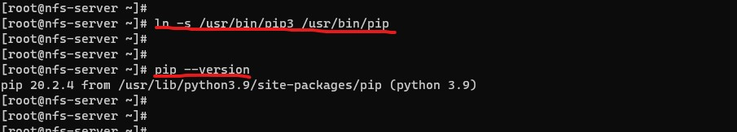

### Development Tools installation

To be able to install and build Python modules with pip, you need to install the Development tools:

```
dnf install python3-devel -y
```

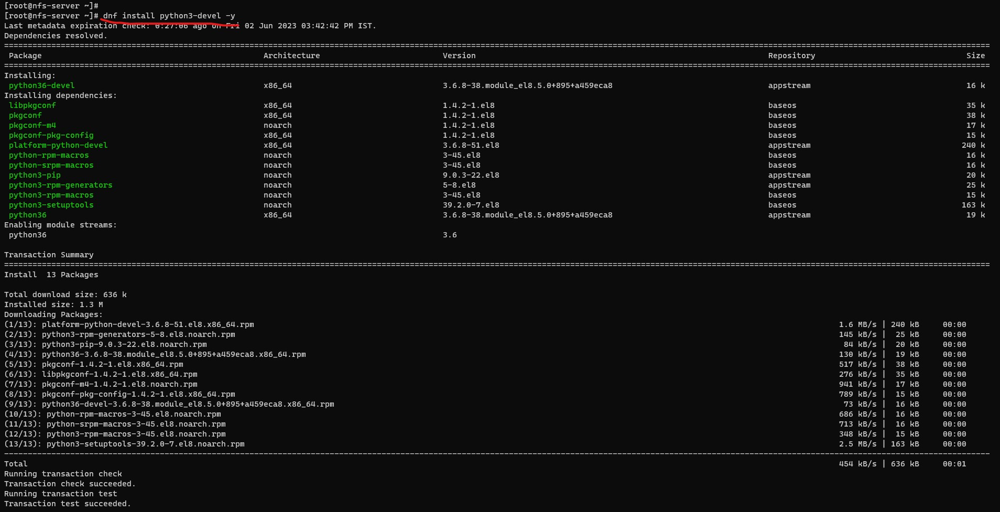
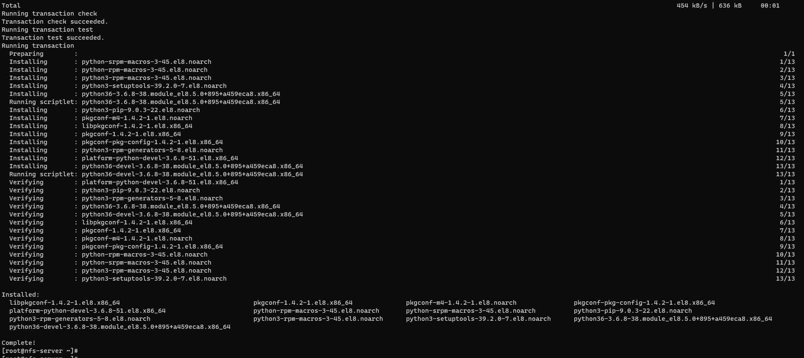

```
dnf groupinstall 'development tools' -y 
```

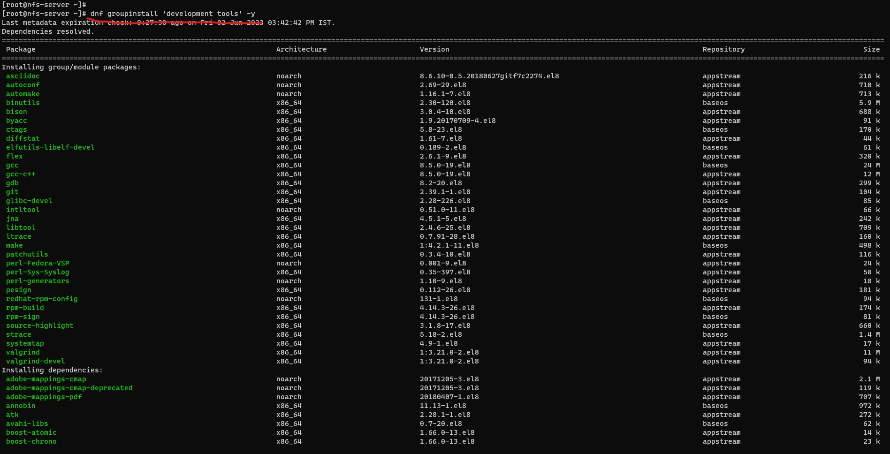
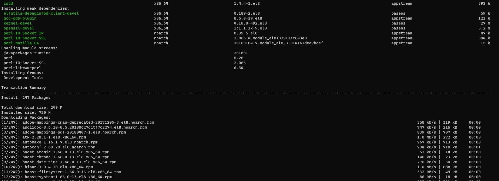


***Python3 & Pip3 is successfully setup on CentOS 8 Stream.***
