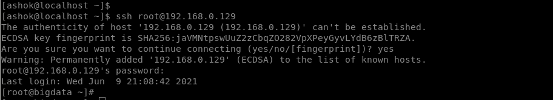
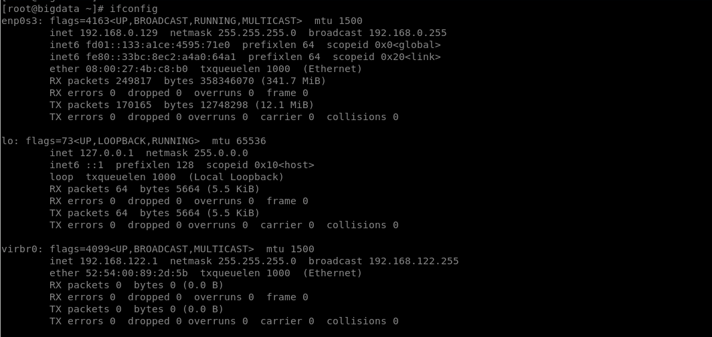
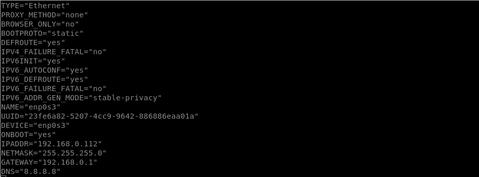
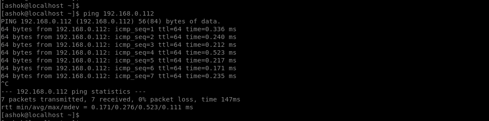

# SETTING UP STATIC IP ADDRESS ON A REMOTE MACHINE

#### Introduction

Static IP address for a machine / server is required. It is, because whenever the machine / server restarts a new IP Address is assigned to it. The Clients which are connecting to this server still uses the same IP Address and leads to the applications failures. So this is why we need a STATIC IP ADDRESS for a server / machine. It is most common with the Cloud instances.

#### Pre-requisites

- The important requirement is the PUBLIC IP or PUBLIC DNS NAME which is generated dynamically for the first time when the server is online.
- SUDO or ROOT user access to the Remote Server
- SSH Client

#### Setting up the static IP

- Login to the Remote server using PUBLIC IP / DNS with SUDO or ROOT credentials. In this case the Remote Server IP Address is `192.168.0.129` and the user is `root`

    `ssh root@192.168.0.129`

    

- Verify the NETWORK ADAPTER, NETMASK and BROADCAST address using the command `ifconfig`

    `ifconfig`

    

    NOTE: From the above screenshot we get the NETWORK ADAPTER as `enp0s3`, NETMASK as `255.255.255.0` & BROADCAST as `192.168.0.255` But for broadcast we use with the starting IP Address like `192.168.0.1`

- Setting up the STATIC IP Configuration in the below file. (For this example the STATIC IP is `192.168.0.112`)

    `vi /etc/sysconfig/network-scripts/ifcfg-enp0s3`

  ```
  TYPE="Ethernet"
  PROXY_METHOD="none"
  BROWSER_ONLY="no"
  BOOTPROTO="static"
  DEFROUTE="yes"
  IPV4_FAILURE_FATAL="no"
  IPV6INIT="yes"
  IPV6_AUTOCONF="yes"
  IPV6_DEFROUTE="yes"
  IPV6_FAILURE_FATAL="no"
  IPV6_ADDR_GEN_MODE="stable-privacy"
  NAME="enp0s3"
  UUID="23fe6a82-5207-4cc9-9642-886886eaa01a"
  DEVICE="enp0s3"
  ONBOOT="yes"
  IPADDR="192.168.0.112"
  NETMASK="255.255.255.0"
  GATEWAY="192.168.0.1"
  DNS="8.8.8.8"
  ```

  

- Reboot the machine / server

  `reboot`

  

- Validate the STATIC IP by pinging the server

  `ping 192.168.0.112`

  

- Login to Remote server using STATIC IP

  `ssh root@192.168.0.112`

  

THERE YOU GO, WE SUCCESSFULLY SET UP A STATIC IP FOR A REMOTE SERVER / MACHINE

## ***Cheers & Happy Coding...!!!***