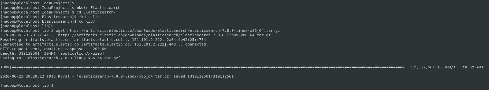
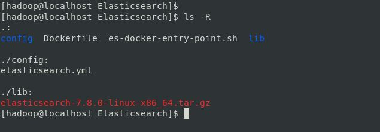
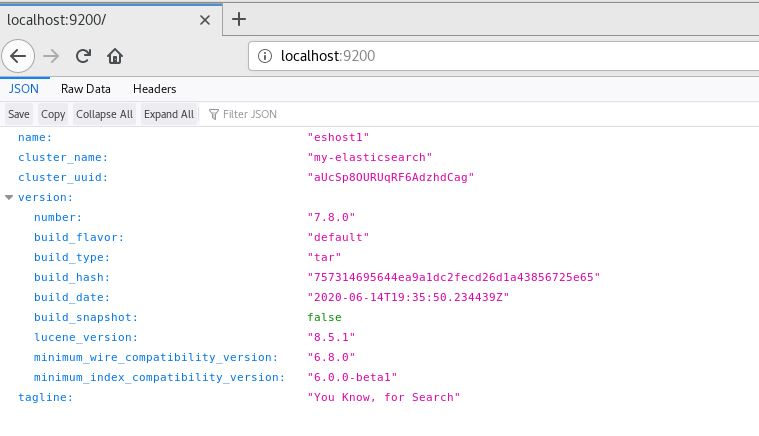

# ELASTICSEARCH ON DOCKER

## Pre-requisites

### Virtual Memory

Elasticsearch uses a `mmapfs` directory by default to store its indices. The default operating system limits on mmap counts is likely to be too low, which may result in out of memory exceptions.

On Linux, you can increase the limits by running the following command as `root`:

```
sysctl -w vm.max_map_count=262144
```

To set this value permanently, update the `vm.max_map_count` setting in `/etc/sysctl.conf`. To verify after rebooting, run `sysctl vm.max_map_count`.

The RPM and Debian packages will configure this setting automatically. No further configuration is required.

NOTE: This has to be done on the HOST machine where the Docker container will be running.

## Creating Elasticsearch Image

To create the Elasticsearch Docker, CentOS 7 is used as the base image.

### Download Elasticsearch

[Click Here](https://www.elastic.co/downloads/elasticsearch) to download the latest version of Elasticsearch.

Download the required verison of Elasticsearch and save it in lib under Elasticsearch directory as shown below:

```
$ cd

$ mkdir Elasticsearch

$ cd Elasticsearch

$ mkdir lib

$ cd lib

$ wget https://artifacts.elastic.co/downloads/elasticsearch/elasticsearch-7.8.0-linux-x86_64.tar.gz

```



### Writing a Dockerfile

The below is the Dockerfile is used to build the Docker image for Elasticsearch(7.8.0) with OpenJDK 8 on CentOS 7:

```
FROM centos:7

LABEL maintainer="Ashok Kumar Choppadandi <ashokkumar98778@gmail.com>"

USER root

RUN yum update -y
RUN yum install java-1.8.0-openjdk-devel -y

ENV ES_HOME /usr/local/elasticsearch

RUN useradd -m -s /bin/bash elasticsearch

WORKDIR /home/elasticsearch

COPY ./lib/elasticsearch*.tar.gz /home/elasticsearch
COPY ./es-docker-entry-point.sh /home/elasticsearch/
RUN chmod +x /home/elasticsearch/es-docker-entry-point.sh

RUN tar -xzvf elasticsearch*.tar.gz -C /usr/local/
RUN rm -rf /home/elasticsearch/*.tar.gz
RUN mv /usr/local/elasticsearch* $ES_HOME

COPY ./config/elasticsearch.yml /usr/local/elasticsearch/config/elasticsearch.yml

RUN chown -R elasticsearch:root /usr/local/elasticsearch*

ENV ES_CLUSTER_NAME elasticsearch
ENV ES_NODE_NAME node1
ENV ES_NODE_MASTER true
ENV ES_DATA_PATH $ES_HOME/data
ENV ES_LOGS_PATH $ES_HOME/logs
ENV ES_NETWORK_HOST 0.0.0.0
ENV ES_HTTP_PORT 9200
ENV ES_DISCOVERY_SEED_HOSTS "127.0.0.1, [::1]"
ENV ES_MASTER_NODES "node1"
ENV PATH $ES_HOME/bin:$PATH

USER elasticsearch
ENTRYPOINT ["./es-docker-entry-point.sh"]

```

### Configurations for Elasticsearch

Elasticsearch used `elasticsearch.yml` as it's configuration file and this config file is created under `config` directory:

```
$ mkdir config

$ cd config

$ ls 
elasticsearch.yml

```
[Click Here](https://github.com/AshokKumarChoppadandi/dev-environments/blob/feature/elasticsearch-docker-setup/Elasticsearch/config/elasticsearch.yml) to see the config file.

### Creating the Entrypoint

Entrypoint is kind of a script, it will be the first thing that will start it's execution whenever the Docker Container starts.

The `es-docker-entry-point.sh` is the Entrypoint script for this Elasticsearch Docker image

```
#!/bin/sh
#set -e

echo "export JAVA_HOME=/usr/lib/jvm/$(ls /usr/lib/jvm/ | grep java-1.8.0-openjdk-1.8.0)" >> ~/.bashrc
echo "export PATH=$PATH:$JAVA_HOME/bin" >> ~/.bashrc

source ~/.bashrc
elasticsearch

```

### Building the Image

Before build the image, the directory structure should look like below:

```
[hadoop@localhost Elasticsearch]$ 
[hadoop@localhost Elasticsearch]$ ls -R
.:
config  Dockerfile  lib

./config:
elasticsearch.yml

./lib:
elasticsearch-7.8.0-linux-x86_64.tar.gz
[hadoop@localhost Elasticsearch]$

```



The below is the command used to build the Docker Image for Elasticsearch

```
docker build . -t ashokkumarchoppadandi/elasticsearch:latest
```

### Launching Elasticsearch Container

The below is the command to launch the elasticsearch docker container:

```
docker run -idt -p 9200:9200 ashokkumarchoppadandi/elasticsearch:latest sh
```

To get the status of the Container:

```
docker ps
```

To check the logs from the container:

```
docker logs [container_id]
```
Once the container is up and running, check whether the Elasticsearch is running at URL: `localhost:9200`



