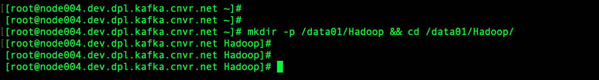

# Hadoop Installation

### Login to Remote Host

```
ssh achoppadandi@node004.dev.dpl.kafka.cnvr.net

sudo su -
```


### Create Hadoop Directory

```
mkdir /data01/Hadoop && cd /data01/Hadoop/
```



### Pre-requisites

* Java 8

### Download Hadoop

```
wget https://archive.apache.org/dist/hadoop/common/hadoop-2.7.6/hadoop-2.7.6.tar.gz
```


### Extract Hadoop

```
tar -xzf hadoop-2.7.6.tar.gz
```

### Soft Link

```
ln -s hadoop-2.7.6 hadoop
```


### Setting JAVA_HOME, HADOOP_HOME & HADOOP_CONF_DIR

```
vi /etc/profile
```

```
# Setting up JAVA_HOME
export JAVA_HOME=/usr/lib/jvm/java
export PATH=$PATH:$JAVA_HOME/bin

# Setting HADOOP_HOME
export HADOOP_HOME=/data01/Hadoop/hadoop
export PATH=$PATH:$HADOOP_HOME/bin:$HADOOP_HOME/sbin
export HADOOP_CONF_DIR=$HADOOP_HOME/etc/hadoop
```

```
source /etc/profile
```


### Configuration

#### core-site.xml

```
vi /data01/Hadoop/hadoop/etc/hadoop/core-site.xml
```

```
<?xml version="1.0" encoding="UTF-8"?>
<?xml-stylesheet type="text/xsl" href="configuration.xsl"?>
<configuration>
    <property>
        <name>hadoop.tmp.dir</name>
        <value>/data01/Hadoop/hadoop/data/tmp</value>
    </property>
    <property>
        <name>fs.default.name</name>
        <value>hdfs://node004.dev.dpl.kafka.cnvr.net:9000</value>
    </property>
</configuration>
```


#### hdfs-site.xml

```
vi /data01/Hadoop/hadoop/etc/hadoop/hdfs-site.xml
```

```
<?xml version="1.0" encoding="UTF-8"?>
<?xml-stylesheet type="text/xsl" href="configuration.xsl"?>
<configuration>
    <property>
        <name>dfs.namenode.name.dir</name>
        <value>/data01/Hadoop/hadoop/data/namenode</value>
    </property>
    <property>
        <name>dfs.datanode.data.dir</name>
        <value>/data01/Hadoop/hadoop/data/datanode</value>
    </property>
    <property>
        <name>dfs.namenode.checkpoint.dir</name>
        <value>/data01/Hadoop/hadoop/data/namesecondary</value>
    </property>
    <property>
        <name>dfs.replication</name>
        <value>3</value>
    </property>
    <property>
        <name>dfs.namenode.datanode.registration.ip-hostname-check</name>
        <value>false</value>
    </property>
</configuration>
```


#### mapred-site.xml

```
vi /data01/Hadoop/hadoop/etc/hadoop/mapred-site.xml
```

```
<?xml version="1.0"?>
<?xml-stylesheet type="text/xsl" href="configuration.xsl"?>
<configuration>
    <property>
        <name>mapreduce.framework.name</name>
        <value>yarn</value>
    </property>
    <property>
        <name>mapreduce.job.tracker</name>
        <value>node004.dev.dpl.kafka.cnvr.net:9001</value>
    </property>
    <property>
        <name>mapreduce.jobhistory.webapp.address</name>
        <value>node004.dev.dpl.kafka.cnvr.net:19888</value>
    </property>
    <property>
        <name>yarn.nodemanager.resource.memory-mb</name>
        <value>8192</value>
    </property>
    <property>
        <name>yarn.scheduler.maximum-allocation-mb</name>
        <value>8192</value>
    </property>
    <property>
        <name>yarn.scheduler.minimum-allocation-mb</name>
        <value>512</value>
    </property>
    <property>
        <name>yarn.nodemanager.vmem-check-enabled</name>
        <value>false</value>
    </property>
    <property>
        <name>yarn.app.mapreduce.am.resource.mb</name>
        <value>1024</value>
    </property>
    <property>
        <name>yarn.app.mapreduce.am.command-opts</name>
        <value>-Xmx4096m</value>
    </property>
    <property>
        <name>mapreduce.map.cpu.vcores</name>
        <value>2</value>
    </property>
    <property>
        <name>mapreduce.reduce.cpu.vcores</name>
        <value>2</value>
    </property>
</configuration>
```


#### yarn-site.xml

```
vi /data01/Hadoop/hadoop/etc/hadoop/yarn-site.xml
```

```
<?xml version="1.0"?>
<configuration>
    <property>
        <name>yarn.acl.enable</name>
        <value>0</value>
    </property>
    <property>
        <name>yarn.resourcemanager.hostname</name>
        <value>node004.dev.dpl.kafka.cnvr.net</value>
    </property>
    <property>
        <name>yarn.nodemanager.aux-services.mapreduce.shuffle.class</name>
        <value>org.apache.hadoop.mapred.ShuffleHandler</value>
    </property>
    <property>
        <name>yarn.resourcemanager.scheduler.address</name>
        <value>node004.dev.dpl.kafka.cnvr.net:8030</value>
    </property>
    <property>
        <name>yarn.resourcemanager.address</name>
        <value>node004.dev.dpl.kafka.cnvr.net:8032</value>
    </property>
    <property>
        <name>yarn.resourcemanager.webapp.address</name>
        <value>node004.dev.dpl.kafka.cnvr.net:8088</value>
    </property>
    <property>
        <name>yarn.resourcemanager.resource-tracker.address</name>
        <value>node004.dev.dpl.kafka.cnvr.net:8031</value>
    </property>
    <property>
        <name>yarn.resourcemanager.admin.address</name>
        <value>node004.dev.dpl.kafka.cnvr.net:8033</value>
    </property>
    <property>
        <name>yarn.nodemanager.aux-services</name>
        <value>mapreduce_shuffle</value>
    </property>
    <property>
        <name>yarn.nodemanager.resource.memory-mb</name>
        <value>8192</value>
    </property>
    <property>
        <name>yarn.scheduler.maximum-allocation-mb</name>
        <value>8192</value>
    </property>
    <property>
        <name>yarn.scheduler.minimum-allocation-mb</name>
        <value>512</value>
    </property>
    <property>
        <name>yarn.nodemanager.resource.cpu-vcores</name>
        <value>2</value>
    </property>
    <property>
        <name>yarn.nodemanager.vmem-check-enabled</name>
        <value>false</value>
    </property>
    <property>
        <name>yarn.nodemanager.disk-health-checker.max-disk-utilization-per-disk-percentage</name>
        <value>95</value>
    </property>
    <property>
        <name>yarn.nodemanager.pmem-check-enabled</name>
        <value>false</value>
    </property>
</configuration>
```


#### hadoop-env.sh

```
vi /data01/Hadoop/hadoop/etc/hadoop/hadoop-env.sh
```

```
export JAVA_HOME=/usr/lib/jvm/java
```

#### ssh-config

```
Host *
  UserKnownHostsFile /dev/null
  StrictHostKeyChecking no
  LogLevel quiet
  Port 2122
```


### Creating directories

```
mkdir -p \
  $HADOOP_HOME/data/namenode \
  $HADOOP_HOME/data/datanode \
  $HADOOP_HOME/data/namesecondary \
  $HADOOP_HOME/data/tmp
```


### Format Namenode

```
hdfs namenode -format
```


### Start the Services

#### Namenode

```
hadoop-daemon.sh start namenode
```

#### Secondary Namenode

```
hadoop-daemon.sh start secondarynamenode
```

#### Datanode

```
hadoop-daemon.sh start datanode
```

#### Resource Manager

```
yarn-daemon.sh start resourcemanager
```

#### Node Manager

```
yarn-daemon.sh start nodemanager
```

#### MR History Server

```
mr-jobhistory-daemon.sh start historyserver
```

### Check the process

```
jps
```


#### Namnode

```
http://node004.dev.dpl.kafka.cnvr.net:50070
```

#### Resource Manager

```
http://node004.dev.dpl.kafka.cnvr.net:8088
```

#### MR History Server

```
http://node004.dev.dpl.kafka.cnvr.net:19888
```
