# Setting up the ***PASSWORD LESS LOGIN***

#### Why do we need Password Less Login on a Machine / Server

As the corporate world gradually awakens to the security dangers of relying on easily stolen and shared passwords, alternative security systems have taken the spotlight. There are several alternative authentication methods that do not involve passwords – such as a hardware token (an object the user has that verifies their identity) or biometric methods or devices such as a physical feature belonging to a user, like their thumbprint.

And while these methods all include a different approach to password less authentication, they have one thing in common: The user's authentication data is never stored within the system, as a password would be. It is this crucial element that gives passwordless solutions their security advantage.

There are also some situations where each machine / server has to communicate with / login to other servers and setting up the password less login really helps them to work together very efficiently.

Like:

- Hadoop Cluster
- Kafka Cluster
- Zookeeper Cluster

Login to the same / remote machine using password:

SYNTAX:

```
ssh <user>@<hostname / host ip>
```

EXAMPLE:

```
ssh kafka@localhost
```

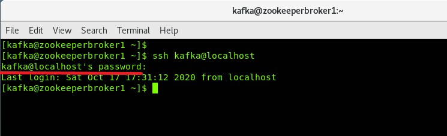

## Same Machine

Steps involved in setting up the Password Less Login in the same machine:

1. Generate SSH Keys
2. Add public key to Authorized Keys
3. Giving right permissions to the Authorized Keys file
4. Verify password less login

##### Generate SSH Keys:

The following is the command to generate the SSH Keys:

```
ssh-keygen -t rsa -f ~/.ssh/id_rsa -q -P ""
```

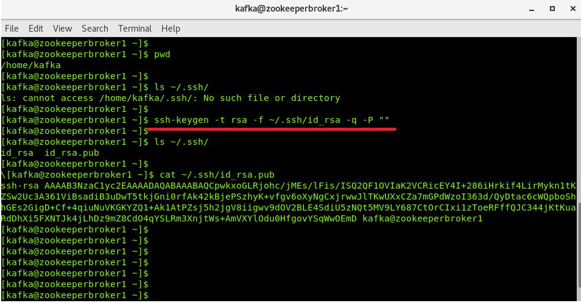


##### Add public key to Authorized Keys

The following is the command to append the public key to authorized_keys file

```
cat ~/.ssh/id_rsa.pub >> ~/.ssh/authorized_keys
```

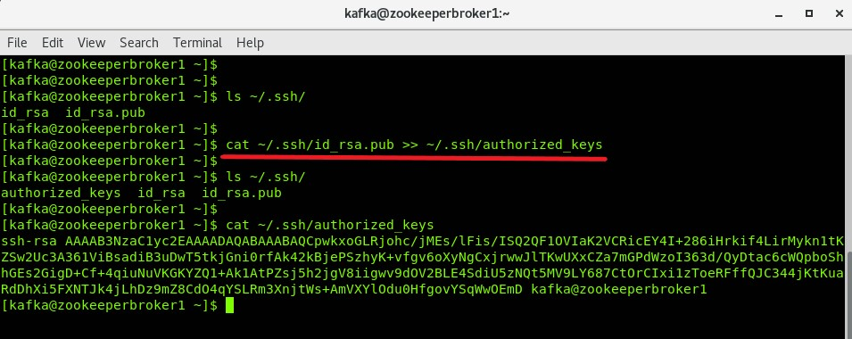

##### Giving right permissions to the Authorized Keys file

The following is the command to give right permissions to authorized_keys file

```
chmod 0600 ~/.ssh/authorized_keys
```

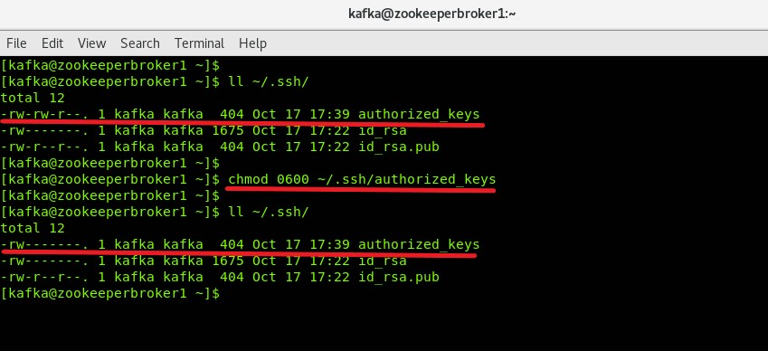

##### Verify password less login

The following is the command to verify the password less login.

```
ssh kafka@localhost
```

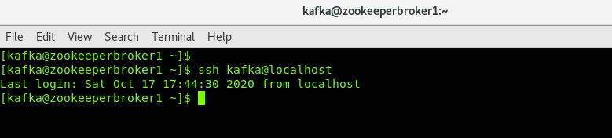

## Remote Machine

Steps involved in setting up the Password Less Login in the same machine:

1. Check our Hostname
2. Our host should be able to connect to Remote Server
3. Generate SSH Keys in local
4. Add public key to Authorized Keys of Remote Server
5. Giving right permissions to the Authorized Keys file in Remote Server
6. Verify the password less login from your host to remote server

##### Check our Hostname

The following is the command to get the `hostname`

```
hostname
```

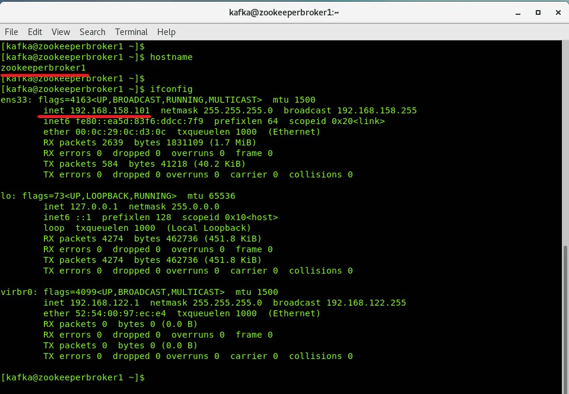

##### Our host should be able to connect to Remote Server

The following is the command to check our host can communicate with the remote server:

SYNTAX:

```
ping <Remote Hostname / Remote Host IP>
```

EXAMPLE:

```
ping 192.168.158.102
```

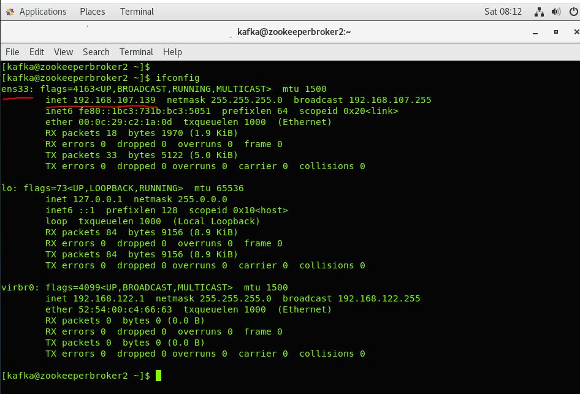

Trying logging into the Remote server using password as follows:

```
ssh kafka@192.168.158.102
```

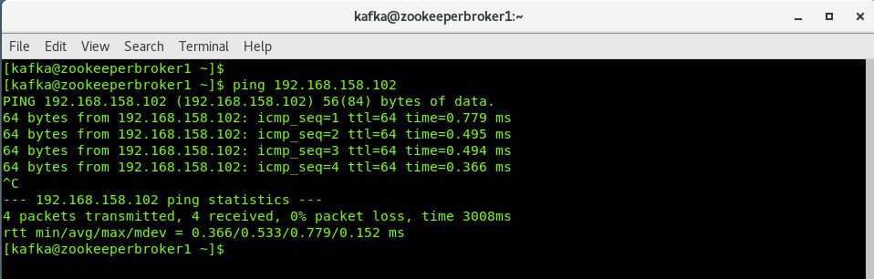

Once you log in to the remote server just exit from it.

##### Generate SSH Keys in local

The following is the command to generate the SSH Keys:

```
ssh-keygen -t rsa -f ~/.ssh/id_rsa -q -P ""
```


Check the generated public key as follows:

```
cat ~/.ssh/id_rsa.pub
```

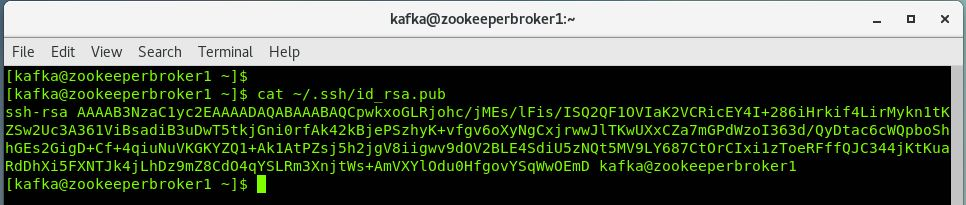

##### Add public key to Authorized Keys of Remote Server

The following is the command used to add the local public key to the authorized_keys file in remote server

```
echo $(cat ~/.ssh/id_rsa.pub) | ssh kafka@192.168.158.102 -T "cat >> ~/.ssh/authorized_keys"
```

***Note:*** This will prompt for the password because the password less login is still not yet setup.

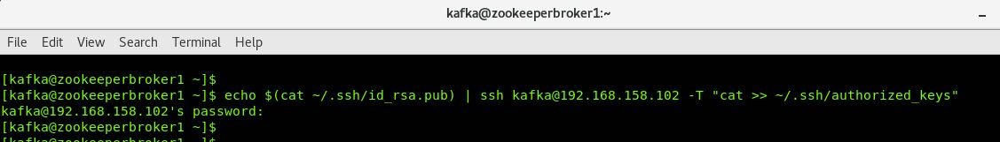

##### Giving right permissions to the Authorized Keys file in Remote Server

Login to the remote server and give right permissions to the authorized_keys file as follows

```
ssh kafka@192.168.158.102
```

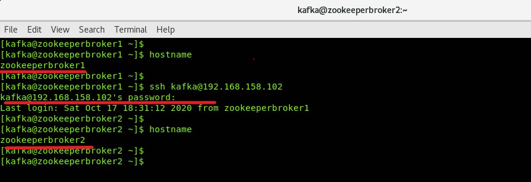

***Note:*** This will prompt for the password because the password less login is still not yet setup.

After successful login set the right permissions to authorized_keys as follows:

```
chmod 0600 ~/.ssh/authorized_keys
```

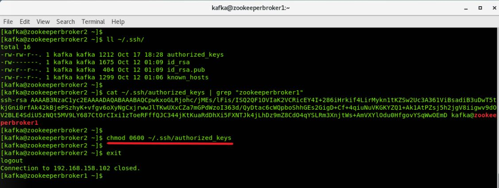

Disconnect from the remote server.

##### Verify the password less login from your host to remote server

Now try logging into the Remote server now this time it should not prompt for the password.

```
ssh kafka@192.168.158.102
```

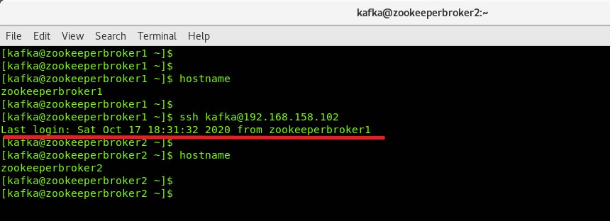

Finally, we are now able to login to the remote server with the password.

