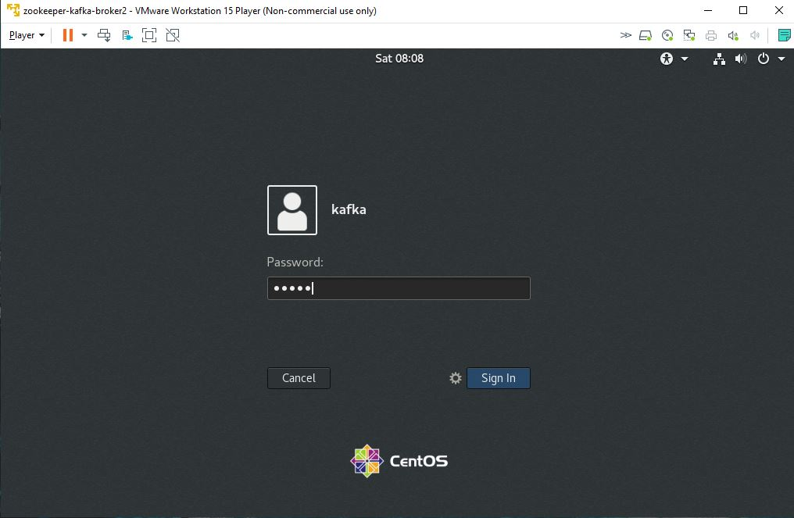
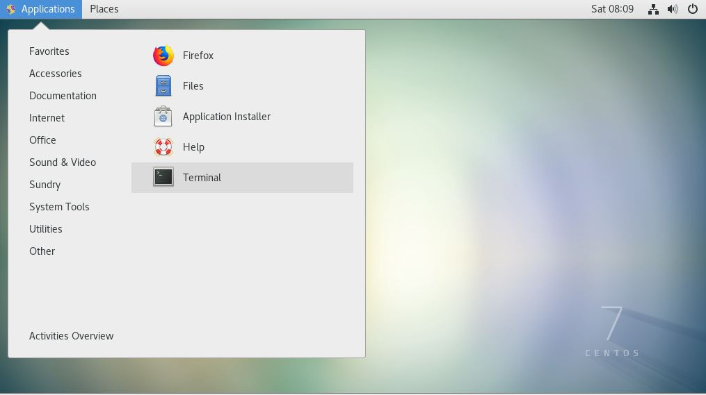
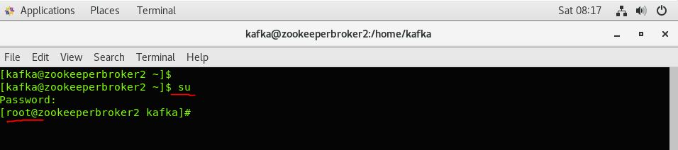
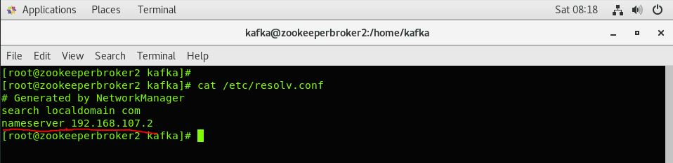
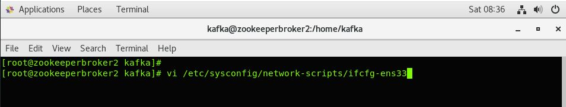
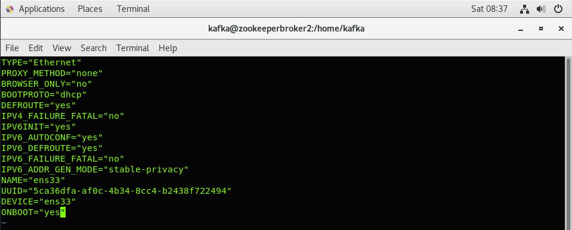
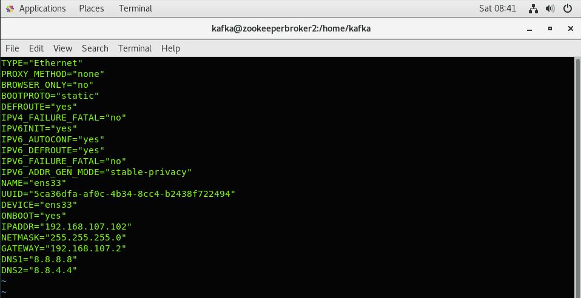
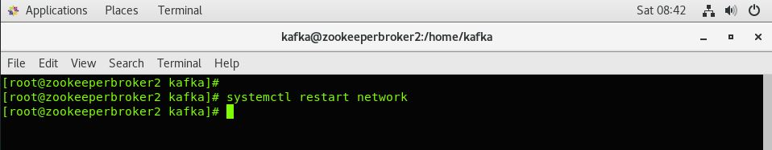
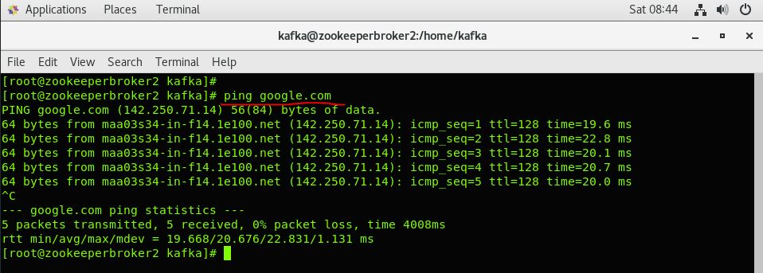

# How To Set Static IP on a CentOS 7 VM using CLI:

### 1. Login to VM



### 2. Open Terminal and check the IP Address:



Use the below command to get the IP Address

	ifconfig


### 3. Switch to ROOT user
    
    su



### 4. Get the Nameserver (Your Router) IP address:

	cat /etc/resolv.conf



### 5. Configurations needs to be changed in the below file:

	vi /etc/sysconfig/network-scripts/ifcfg-ens33



Default configuration for the Network:

```	
        TYPE="Ethernet"
        PROXY_METHOD="none"
        BROWSER_ONLY="no"
        BOOTPROTO="dhcp"
        DEFROUTE="yes"
        IPV4_FAILURE_FATAL="no"
        IPV6INIT="yes"
        IPV6_AUTOCONF="yes"
        IPV6_DEFROUTE="yes"
        IPV6_FAILURE_FATAL="no"
        IPV6_ADDR_GEN_MODE="stable-privacy"
        NAME="ens33"
        UUID="6cdcdd24-ec24-49b9-8a74-0c12bac9aeca"
        DEVICE="ens33"
        ONBOOT="yes"
```



Change the configuration to below :

```	
        TYPE="Ethernet"
        PROXY_METHOD="none"
        BROWSER_ONLY="no"
        BOOTPROTO="static"
        DEFROUTE="yes"
        IPV4_FAILURE_FATAL="no"
        IPV6INIT="yes"
        IPV6_AUTOCONF="yes"
        IPV6_DEFROUTE="yes"
        IPV6_FAILURE_FATAL="no"
        IPV6_ADDR_GEN_MODE="stable-privacy"
        NAME="ens33"
        UUID="6cdcdd24-ec24-49b9-8a74-0c12bac9aeca"
        DEVICE="ens33"
        ONBOOT="yes"
        IPADDR="192.168.107.102"
        NETMASK="255.255.255.0"
        GATEWAY="192.168.107.2"
        DNS1=8.8.8.8
        DNS2=8.8.4.4
```



***Note:*** The Gateway should be Nameserver IP Address.
	
### 6. Restart the Network
 
To restart the Network use the below command:

	systemctl restart network



### 7. Now check the IP address again:

Use the below command to get the IP address

	ifconfig


### 8. Check your internet connectivity:

	ping google.comm



That's completes setting up the STATIC IP for the CentOS 7 VM.


Now the STATIC IP for the CentOS 7 VM is configured Properly.