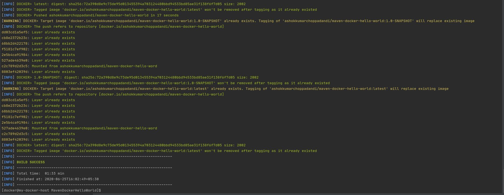
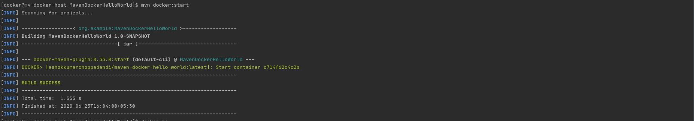
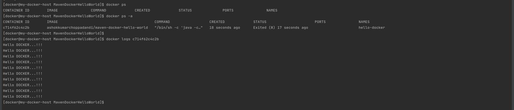

# CREATING HELLO WORLD DOCKER IMAGE USING `docker-maven-plugin`

## Introduction

The goal of this project is create a docker image from Maven project using the `docker-maven-plugin`.

### Pre-requisites

- Docker - 1.6.x or later
- Java - OpenJDK 8
- Maven - 3.6.3
- fabric8 - 0.330

### Advantages

- It can be easily integrated with `CI/CD` tools.
- No need of having full idea on Docker
- It can much more maintainable with different versions as a normal Maven projects.
- It can be used to start / stop Docker containers.
- It can be more configurable with maven run commands.
- Auto pulling of images with progress indicator.
- Properties as alternative to the XML configuration.
- Flexible registry handling (i.e. registries can be specified as metadata)
- Specification of encrypted registry passwords for push and pull in ~/.m2/settings.xml (i.e., outside the pom.xml)
- Watching on project changes and automatic recreation of image
- Support for Docker daemons accepting http or https request via TCP and for Unix sockets

### `docker-maven-plugin`

Maven plugin for building Docker images and managing containers for integration tests. It works with Maven 3.0.5 and Docker 1.6.0 or later.

This plugin is available from Maven central and can be connected to pre- and post-integration phase as seen below. The configuration and available goals will be described below.

*Example*

```
<plugin>
  <groupId>io.fabric8</groupId>
  <artifactId>docker-maven-plugin</artifactId>
  <version>0.33.0</version>

  <configuration>
     ....
     <images>
        <!-- A single's image configuration -->
        <image>
           ....
        </image>
        ....
     </images>
  </configuration>

  <!-- Connect start/stop to pre- and
       post-integration-test phase, respectively if you want to start
       your docker containers during integration tests -->
  <executions>
    <execution>
       <id>start</id>
       <phase>pre-integration-test</phase>
       <goals>
         <!-- "build" should be used to create the images with the
              artifact -->
         <goal>build</goal>
         <goal>start</goal>
       </goals>
    </execution>
    <execution>
       <id>stop</id>
       <phase>post-integration-test</phase>
       <goals>
         <goal>stop</goal>
      </goals>
    </execution>
  </executions>
</plugin>
```

[Click Here](http://dmp.fabric8.io/) to know more about configurations that are available for the docker-maven-plugin (`io.fabric8`).

[Click Here](https://github.com/AshokKumarChoppadandi/dev-environments/blob/feature/maven-docker-hello-world/MavenDockerHelloWorld/pom.xml) to see the `pom.xml` for MavenDockerHelloWorld project.

### Writing the Dockerfile

A Dockerfile is a text document that contains all the commands a user could call on the command line to assemble an image. Using docker build users can create an automated build that executes several command-line instructions in succession.

To more about the Dockerfile, see the documentation at https://docs.docker.com/engine/reference/builder/.

Dockerfile for this MavenDockerHelloWorld project is under `src/main/docker/Dockerfile`.

### Hello World Program

This is just a Simple Java Hello World program which takes one argument and print for 10 times.

*HelloWorld.java* program is under `src/main/java` and under the package `com.bigdata.docker`.

### Build Project

The project can be built as a normal Maven Project.

To build only the Java Project

`mvn clean package`

To build the Java Project, Create a Docker Image with the Jar and Push it to the Docker Registry

`mvn clean install`

To build the Docker Image with the Jar

`mvn docker:build`

To build the Docker Image with the Jar and automatically start the container

`mvn clean install docker:start`

To stop the running docker container

`mvn docker:stop`

To pass the configurations at run time

`mvn clean install -Ddocker.hub.username=DOCKER_HUB_USERNAME -Ddocker.hub.password=DOCKER_HUB_PASSWORD`







## Conclusion

This helps in building the Java / Scala (`jar files`) / WebApplications (`WAR files`) along with the environment setup ready. Docker helps in building the environment for executing the applications in it.

`docker-maven-plugin` helps us in combining these two things together and delivering as a single project.

This makes much more efficient for the developer by letting them know where and how the applications built by them are executed in real time.

### References

1. https://docs.docker.com/engine/reference/builder/
2. https://github.com/fabric8io/docker-maven-plugin
3. http://dmp.fabric8.io/
